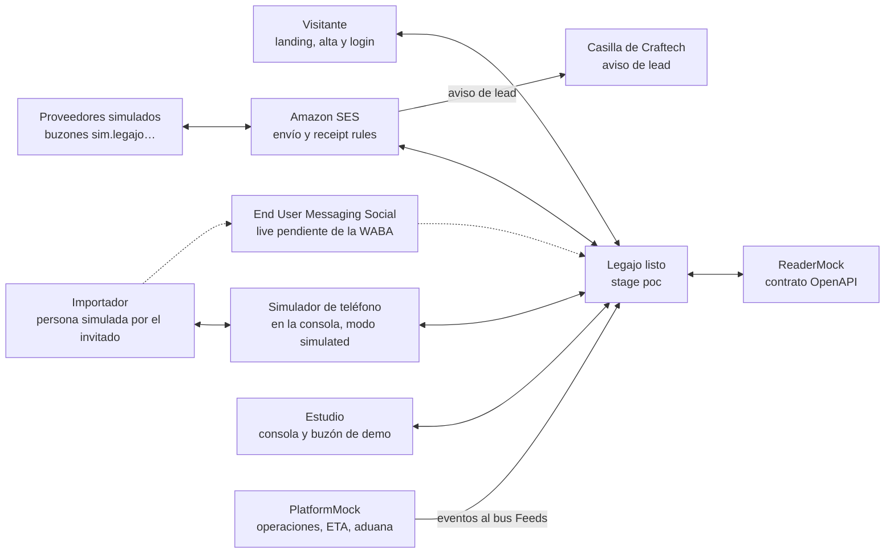
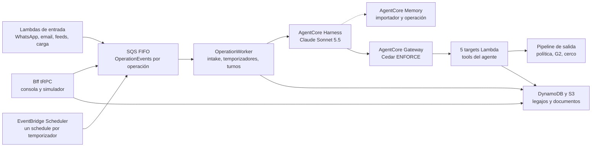
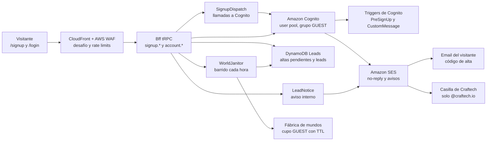
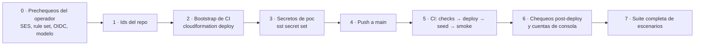

# Arquitectura · aws-cds-hackathon-poc-legajo

Topología, datos, agente, seguridad, IAM, orden de deploy y lecciones heredadas. Lo que lee `devops` para levantar el stack y cualquiera para reproducirlo. Los canales y los sistemas simulados (SES entrante y saliente, simulador de proveedor, buzón de demo, WhatsApp vivo y simulado, lector documental, plataforma de gestión aduanera) están en `docs/architecture-integrations.md`. El diseño funcional está en `docs/design-brief.md`.

## 1. Cuenta, región, dominios y nombres fijos

| Ítem | Valor |
|---|---|
| Cuenta | `craftech-demos` `776805327629` (nunca `craftech-sandbox`, que se destruye a diario) |
| Región | `us-east-1` (Bedrock, AgentCore, End User Messaging Social, SES envío y recepción) |
| App SST | `aws-cds-hackathon-poc-legajo` (28 caracteres) · forma con guiones bajos `aws_cds_hackathon_poc_legajo` |
| Repo | `craftech-io/aws-cds-hackathon-poc-legajo` (privado); org id `60447213`; repo id: `gh api repos/craftech-io/aws-cds-hackathon-poc-legajo --jq .id` (lo carga el operador en el bootstrap) |
| Zona DNS | `demo.craftech.io` (`Z043097217S4W7QWXU5O0`), delegada en la cuenta Demos; se referencia por id, no se gestiona |
| Dominios | Consola y landing `legajo.demo.craftech.io`; hilos de operación `op-<número>-<etiqueta>@legajo.demo.craftech.io` (en los documentos se abrevia `op-4471@`, `docs/architecture-integrations.md` §1); avisos al estudio `avisos@legajo.demo.craftech.io`; buzones simulados `*@sim.legajo.demo.craftech.io`; MAIL FROM propio `bounce.legajo.demo.craftech.io` |
| Identidad SES | Dominio `legajo.demo.craftech.io` (cubre `sim.` para enviar), Easy DKIM (firma con `d=legajo.demo.craftech.io`, alineado en modo relajado con todo `From` de los dos dominios), MAIL FROM `bounce.legajo.demo.craftech.io` (MX de feedback de SES + TXT SPF `v=spf1 include:amazonses.com -all`) para que también SPF quede alineado |
| DMARC | Registros explícitos por **cada dominio desde el que enviamos o del que aceptamos correo**, todos `v=DMARC1; p=reject; adkim=r; aspf=r`: `_dmarc.legajo.demo.craftech.io` y `_dmarc.sim.legajo.demo.craftech.io`. Un receptor (RFC 7489) busca `_dmarc.<dominio del From>` y después el del dominio organizacional (`_dmarc.craftech.io`, en `craftech-root`, que este proyecto no gestiona): sin el registro de `sim.` el veredicto de nuestro propio simulador dependería de una zona ajena. Los declara `infra/messaging-email.ts` junto a los MX |
| Modelo | `global.anthropic.claude-sonnet-5-5` (perfil de inferencia global; verificar `ACTIVE` y la cuota de tokens por minuto, §17 ítems 6 y 7) |
| Providers | `aws` 7.32.0, `aws-native` 1.74.1 (pinneados; cambio solo con ADR); SST `4.17.1`; Node 22 arm64 (versión exacta en `.nvmrc` y `engines`) |

Nombres fijos (sin prefijo de stage, únicos por cuenta, dentro de la cerca de prefijo del rol de CI):

| Recurso | Nombre | Por qué fijo |
|---|---|---|
| Receipt rule set SES activo | `aws-cds-hackathon-poc-legajo-inbound` | SES admite **un solo rule set activo por región** |
| Bucket de correo entrante | `aws-cds-hackathon-poc-leg-inbound-mail-776805327629` | La política de bucket confía en las reglas del rule set; el nombre de S3 es global: el sufijo de cuenta lo hace imposible de ocupar por un tercero y el prefijo lo deja dentro de la cerca `aws-cds-hackathon-poc-leg*` |
| Topic SNS de WhatsApp | `aws-cds-hackathon-poc-legajo-wa-inbound` | Una WABA tiene un solo destino de eventos |
| Rol de deploy de CI | `aws-cds-hackathon-poc-legajo-github-deploy` | Lo crea el bootstrap (ADR-0009) |
| Rol del ejecutor de escenarios | `aws-cds-hackathon-poc-legajo-qa-runner` | Lo crea el bootstrap (ADR-0005) |
| Boundary | `aws-cds-hackathon-poc-legajo-ci-boundary` | Estampada en todo rol del app por `infra/ci.ts` |
| Path IAM | `/aws-cds-hackathon-poc-legajo/` | Cerca IAM del rol de deploy |
| Función QA | `aws-cds-hackathon-poc-legajo-poc-qa-driver` | Nombre fijado para que el rol del ejecutor la cerque por ARN |
| Configuration sets | `aws-cds-hackathon-poc-legajo-email-poc` · `aws-cds-hackathon-poc-legajo-sim-poc` | Cercados por nombre en el rol de CI |
| Web ACL de WAF (scope `CLOUDFRONT`) | `aws-cds-hackathon-poc-legajo-poc-edge` | Cercada por nombre en el rol de CI; la asocia el Router (ADR-0015 §3) |

`ci-role.test.ts` verifica que cada nombre fijo de esta tabla está cubierto por un statement con su ARN exacto (`docs/reuse-map.md`, fila del bootstrap).

**Identificadores internos y superficies visibles** (ADR-0014 §1): el nombre de la app, del repo y de los recursos derivados no son superficie visible (aparecen solo en la cuenta y en el tráfico: buckets en la CSP y en URLs prefirmadas) y no se renombran; ningún texto que lee una persona usuaria los usa, y `npm run lint:neutral-surfaces` lo verifica sobre las fuentes visibles y el build de la web.

## 2. Stage e Ingress

Un solo stage: **`poc`**, desplegado con `sst deploy --stage poc` solo desde CI en push a `main`. No hay stage `local`: `sst dev` crea recursos reales en la cuenta y modificaría el Ingress compartido (reglas del rule set activo, MX de la zona delegada, suscripción al topic), lo que contradice la regla de deploy solo por CI (R4). El desarrollo se hace con pruebas `U`, `LF` y `UI` locales (`docs/test-plan.md` §2) y se verifica en `poc` por CI. `sst.config.ts` rechaza cualquier stage distinto de `poc`.

Reglas del rule set `aws-cds-hackathon-poc-legajo-inbound`:

| Regla | Destinatarios | Acciones |
|---|---|---|
| `ops-poc` | `legajo.demo.craftech.io` | S3 `aws-cds-hackathon-poc-leg-inbound-mail-776805327629/poc/ops/` → Lambda `InboundEmail` (`Event`) |
| `sim-poc` | `sim.legajo.demo.craftech.io` | S3 `…/poc/sim/` → Lambda `SimMail` (`Event`) |

Las dos con `scanEnabled: true` (veredictos de spam y virus). El MX de `bounce.legajo.demo.craftech.io` apunta al endpoint de feedback de SES y no tiene regla.

## 3. Secretos (`sst.Secret`)

Declarados una sola vez en `infra/secrets.ts`; leídos con `secretValue(nombre)` de `packages/bff/src/lib/secrets.ts` (zod). Un secreto sin valor aborta el deploy: todos se cargan antes del primer deploy (§15 paso 3).

| Secreto | Uso | Valor inicial |
|---|---|---|
| `SessionTokenKey` | Clave maestra. **Nunca se usa directo**: `lib/crypto.ts` deriva una subclave por propósito con HKDF-SHA256 y etiquetas fijas `session` (`sessionToken`), `phone-hash`, `email-hash`, `nonce` (botones), `sim-envelope` (firma del sobre simulado), `thread` (etiqueta de la dirección de la operación), `runtime-session` (`runtimeSessionId`), `signup-ticket` (ticket de alta), `signup-seal` (cifrado AES-256-GCM de la contraseña en tránsito a `SignupDispatch`), `lead-email` (hash del email de un lead y de `MAILSTATUS#`), `rate` (hash de IP y de dominio de los rate limits del alta) y `form` (firma de `formShownAt`) (ADR-0015). Un valor filtrado de un propósito (p. ej. una firma de sobre en un log) no compromete los demás | 32 bytes aleatorios en base64; rotarlo obliga a recargar el seed |
| `WabaId` | Id de la WABA de EUM Social | `not-connected` hasta P-01 |
| `WhatsAppPhoneNumberId` | `originationPhoneNumberId` de `SendWhatsAppMessage` | `not-connected` hasta P-01 |
| `SeedOverrides` | JSON con destinatarios de demo registrados (emails del equipo para el buzón del estudio, teléfonos de prueba para WhatsApp vivo); nunca aplica a mundos de invitado | `{}` |
| `OriginVerifyKey` | Valor del encabezado `X-Origin-Verify` que CloudFront agrega en `/api/*` y `/u/*`; los handlers de `Bff` y `PublicWeb` lo exigen como primer paso de toda ruta, detrás de OAC (ADR-0015 §3.1) | 32 bytes aleatorios en base64 |
| `LeadNoticeTo` | Hasta 3 direcciones `@craftech.io`, separadas por coma, que reciben el aviso de cada lead nuevo; el cerco rechaza cualquier otro dominio | `disabled` hasta que el operador cargue `janu@craftech.io` |

Verificación: `npx sst secret list --stage poc` (imprime valores: no se comparte ni se pega en ningún lado). Riesgo residual declarado en §13: SST cifra los secretos linkeados dentro del bundle y deja la clave de descifrado (`SST_KEY`) en una variable de entorno de la función.

## 4. Componentes

| Componente | Servicio | Por qué |
|---|---|---|
| Agente | **Bedrock AgentCore Harness** (`awsnative.bedrockagentcore.Harness`) con endpoint `live`; modelo `global.anthropic.claude-sonnet-5-5`, `converse_stream`, `maxIterations 12`, `maxTokens 2048`, `timeoutSeconds 120`, `truncation sliding_window 40`; `tools` = solo el Gateway; `allowedTools: ["@legajo-tools/*"]`; sin shell, archivos ni code interpreter; guardrail G1 | Loop gestionado, tools por Gateway, memoria y guardrail por invocación; el mismo patrón probado en el scaffolding (ADR-0001) |
| Tools | **AgentCore Gateway** MCP (`AWS_IAM`, exclusivo del Harness) + 5 `GatewayTarget` Lambda (`operations`, `documents`, `messaging`, `followups`, `handoff`) con `toolSchema.inlinePayload` generado desde zod | Un target por dominio, permisos mínimos por Lambda |
| Autorización de tools | **AgentCore Policy** (Cedar `ENFORCE`) + `sessionToken` HMAC + zod `.strict()` en cada Lambda | Cedar: permits por target y cercas estáticas; identidad y alcance por sesión en la Lambda (`docs/design-brief.md` §5.6) |
| Memoria | **AgentCore Memory** con tres estrategias propias con instrucción de exclusión | §9.3 |
| Seguridad de contenido | **Bedrock Guardrails** G1 (pre-filtro determinista del worker con `ApplyGuardrail` y `guardrailConfig` del Harness) y G2 (`ApplyGuardrail` en el pipeline de salida) | `docs/design-brief.md` §5.5 |
| Orquestación por operación | **SQS FIFO** `OperationEvents.fifo` (`MessageGroupId = operationId`) + Lambda `OperationWorker` (concurrencia reservada 5) + DLQ `OperationEventsDlq.fifo` | Serializa intake, turnos, temporizadores, envíos de la consola y cambios de ETA de una operación; deduplica por evento |
| Temporizadores | Item `Operations/TIMER#<kind>#<id>` + **EventBridge Scheduler** (a lo sumo un schedule `at()` por temporizador, grupo `aws-cds-hackathon-poc-legajo-poc-schedules`, `ActionAfterCompletion DELETE`, destino `ScheduleDispatch`) | Hitos, envíos diferidos, seguimientos, respuestas del simulador, reintentos del lector, controles de contacto y reintentos de rebote con un solo mecanismo que el reloj de demo sabe avanzar (ADR-0004, §8) |
| Reloj de demo | Item `Runtime/CLOCK#<clockId>` (modo `RUNNING` o `PAUSED`, `worldEpoch`, ajustes del mundo) + GSI de vencimientos + `advance_clock` | ADR-0007, §8 |
| Mundos | Fábrica de mundos (`packages/bff/src/worlds/`): demo por estudio, un mundo propio por invitado (cupos reservados y públicos con TTL), mundos QA y lotes de métricas | §8, ADR-0015 §4, `docs/seed-spec.md` §3 |
| Feeds externos | **EventBridge** bus `Feeds`, fuentes `mock.platform.carrier` y `mock.platform.customs` → `FeedEvents` | Los sistemas simulados empujan eventos como lo haría uno real |
| Email | **Amazon SES v2** envío + receipt rules | `docs/architecture-integrations.md` §1-§3 |
| WhatsApp | **AWS End User Messaging Social** (`@aws-sdk/client-socialmessaging`), adaptador implementado y probado con fixtures; corre en modo `simulated` (simulador de teléfono en la consola) hasta que la WABA esté conectada (P-01) | `docs/architecture-integrations.md` §4 |
| Lector documental (mock externo) | Lambda `ReaderMock` con Function URL `AWS_IAM` + tabla propia `ReaderCatalog`; contrato OpenAPI 3.1 | ADR-0003; `docs/architecture-integrations.md` §5 |
| Plataforma de gestión aduanera (mock externo) | Lambda `PlatformMock` con Function URL `AWS_IAM` + tabla propia `Platform` + publicación en `Feeds` | `docs/architecture-integrations.md` §6 |
| Datos | **DynamoDB** una tabla por agregado (§5), **S3** (§6) con **GuardDuty Malware Protection for S3** en `Uploads` y `Media` | Patrón del scaffolding |
| Landing, alta y consola | **CloudFront Router** + **StaticSite** (React 19 + Vite + Tailwind v4: landing `/`, alta `/signup`, login `/login`, consola `/app/*`) + Function tRPC v11 + **Cognito** (login propio SRP; alta propia con email verificado por código) | §10, ADR-0015, ADR-0016 |
| Borde | **AWS WAF** (web ACL `…-poc-edge` en la distribución: reputación de IP, rate limits y desafío silencioso en el documento `/signup` y en `signup.*`) + **OAC** del Router para las Function URL (`AWS_IAM`) + encabezado de origen verificado en `/api/*` y `/u/*` | ADR-0015 §3 |
| Leads | Tabla **`Leads`** (separada de la demo) + Lambda `SignupDispatch` (llamadas a Cognito del alta, fuera del camino de respuesta) + Lambda `LeadNotice` (aviso por SES a `@craftech.io`) + scripts `leads:export`, `leads:optout`, `leads:delete` | §10, ADR-0015 §6 |
| Superficie pública | Function `PublicWeb` en `/u/*` + bucket `Uploads` con POST prefirmado | §11 |
| Observabilidad | **CloudWatch** logs JSON con redacción, métricas `LegajoAgent/*`, alarmas, Transaction Search, **AWS Budgets** filtrado por el tag `Project` | §12 |
| QA en el stage | Lambda `QaDriver` (nombre fijo, sin URL) invocada por el rol `qa-runner` | ADR-0005, `docs/test-plan.md` §4 |
| Infra y CI | **SST v4**, GitHub Actions + OIDC, bootstrap de CloudFormation | ADR-0009 |

Contexto: ¿quién habla con Legajo listo y por dónde?

Línea llena: camino que corre en `poc`. Línea punteada: WhatsApp vivo, implementado y probado con fixtures, que se activa al cerrar P-01. El simulador de teléfono entra por el mismo sobre y el mismo normalizador que el evento real de EUM Social.

Internos: ¿qué pasa dentro de Legajo listo con un evento?

El pipeline de salida entrega a SES o a EUM Social (contexto de arriba) y también lo usa el worker para los envíos deterministas y los que ordena la consola; los guardrails G1 (pre-filtro del worker y Harness) y G2 (pipeline) no se dibujan como cajas porque sirven a un solo consumidor cada uno.

Alta pública: ¿por dónde pasa un registro hasta que el invitado tiene su mundo? (ADR-0015)

El navegador nunca llama a `SignUp`: el `Bff` guarda el alta, responde siempre igual e invoca asíncrona a `SignupDispatch`, que llama a Cognito con un ticket firmado que `PreSignUp` exige; `CustomMessage` corta los emails de cuenta que superan las cuotas por destinatario, los de destinatarios que rebotaron y todos (salvo invitaciones) con el disyuntor abierto. El `Bff` llama a Cognito directo solo para confirmar el código y agregar el grupo. El login SRP y la recuperación de contraseña siguen yendo del navegador a Cognito directo (no dibujado). El mundo se crea en el primer ingreso: `account.ensureWorld` arrienda y `WorldJanitor` (`GUEST_CREATE`) lo crea con la fábrica de mundos, no al confirmar el alta.

## 5. DynamoDB

Una tabla por agregado (ADR del scaffolding). Nombres lógicos PascalCase; atributos camelCase; ids con prefijo. Cada item lleva `entity`, `createdAt`, `updatedAt`, `version` (bloqueo optimista), `clockId` cuando pertenece a un mundo, `synthetic: true` cuando viene del seed y, en mundos QA y de invitado, `world` (`qa` \| `guest`) y `expiresAt` (TTL): en QA, 48 h; en un mundo de invitado **público**, su vencimiento duro + 24 h, como segunda capa del barrido que lo destruye (§8); los reservados no llevan. Donde la tabla de abajo dice "`expiresAt` en QA", vale también para los mundos de invitado públicos. Fechas ISO 8601 con zona; las fechas de negocio se guardan en tiempo simulado (`…Sim`) y, donde hace falta, también en real (`…Real`). SSE con claves de AWS. Toda transición de estado que después reevalúa `PolicyAudit` (consentimiento, autorización, estado de contacto, control, aprobación) guarda su historia con fecha (`…At` y `history[]`), no solo el estado actual.

| Tabla | Entidades | PK | SK | GSIs | TTL |
|---|---|---|---|---|---|
| `Firms` | Firm (`kind` `DEMO` \| `GUEST` \| `QA`; `guestKind` `RESERVED` \| `PUBLIC` en los `GUEST`), FirmSettings (`manualBaseline{items[{action, minutes, label: "supuesto"}]}`, `assumptions{freeDaysAtPort, demurrageUsdPerDay{min,max}, source}`, `costBudgetUsdPerDossier`, `turnCaps{perHour, perDay}`), Broker, Checklist (versionado), ResponsibilityMatrix (versionada) | `FIRM#<firmId>` | `META` · `SETTINGS` · `BROKER#<brokerId>` · `CHECKLIST#<docType>#v<nnn>` · `RESP_MATRIX#v<nnn>` | `GSI1` `cognitoSubKey` = `SUB#` → broker (principal de la consola) | `expiresAt` en estudios QA |
| `Parties` | Importer, Consent (con `history[]`), SupplierAuthorization (con `history[]`), Supplier, SupplierContact (con `statusHistory[]`), SupplierProfile, AddressClaim | `IMP#<importerId>` · `SUP#<supplierId>` · `ADDR#<hash>` | `META` · `CONSENT#WHATSAPP` · `AUTH#<supplierId>` · `CONTACT#<contactId>` · `PROFILE` · `CLAIM` | `GSI1` `phoneHash` → importador · `GSI2` `emailHash` → contacto de proveedor · `GSI3` `firmKey` = `FIRM#<firmId>#<IMP\|SUP>` + `sortName` (registro) | `expiresAt` en mundos QA |
| `Operations` | Operation (`dossierStatus`, `control` con `controlHistory[]`, `clockId`, `worldEpoch`, `threadAddress`, `threadTag`, `eta`, `etaHistory[]`, `dispatch`, `atRisk` (hito `ARRIVAL` con faltantes, FL-071), `sessionEpoch`, `simBehaviour`, `simState`), Document, DocumentVersion (con `reading`), Observation, Escalation, **Timer** | `OP#<operationId>` | `META` · `DOC#<docType>` · `DOC#<docType>#V#<nnn>` · `OBS#<observationId>` · `ESC#<escalationId>` · `TIMER#<kind>#<timerId>` | `GSI1` `firmStatusKey` = `FIRM#<firmId>#<dossierStatus>` + `etaSort` (lista de la consola) · `GSI2` `threadKey` = `THREAD#<operationNumber>-<threadTag>` (hilo de email; único entre todos los mundos y épocas: la fábrica de mundos reclama la dirección con `Parties/ADDR#<emailHash(threadAddress)>` condicional antes de escribir la operación, `docs/seed-spec.md` §15) · `GSI3` `clockDueKey` = `CLOCK#<clockId>` + `dueAtSim` (sparse: todo `TIMER#` en estado `SCHEDULED`) | `expiresAt` en QA |
| `Conversations` | Message (in/out, cuerpo normalizado y enmascarado, `to`, `from`, `providerMessageId`, `rfcMessageId`, `kind`, `templateName`, `interactive`, `status`, `policy.ruleIds`, `author`, `turnId`, `trusted`, `simulated`, `sentAtSim`), MessageEvent (estado de entrega), TurnNote, MailboxMessage | `OP#<operationId>` · `MAILBOX#<address>` | `MSG#<ts>#<messageId>` · `EVT#<ts>#<eventId>` · `NOTE#<ts>#<turnId>` · `MAIL#<ts>#<id>` | `GSI1` `providerMessageId` → mensaje (estados, `In-Reply-To`, verificación de `SimMail`) · `GSI2` `counterpartKey` = `IMP#<importerId>` \| `CONTACT#<contactId>` + `sentAtSim` (frecuencia diaria y ventana de 24 h) | 90 días; `expiresAt` en QA |
| `AuditLog` | Decision (`decision` ALLOW/DENY/DEFER/ACTION/VIOLATION, `action`, `ruleIds[]`, `evaluated[]`, `messageId`, `trigger`, `actor`, `refs`) | `FIRM#<firmId>#<yyyy-mm>` | `<ts>#<ulid>` | `GSI1` `opKey` = `OP#<operationId>` + `ts` · `GSI2` `decisionKey` = `FIRM#<firmId>#<decision>` + `ts` | 12 meses; `expiresAt` en QA |
| `Reference` | Holiday (AR), Template (WhatsApp), RateCard, DispatchGlossary, ObservationCode (etiquetas es/en), EvalTruth (responsable esperado por observación sembrada), NameCheck (lista de nombres ficticios verificados) | `REF#<type>#<scope>` | clave del tipo | — | — |
| `Runtime` | Session, TurnResult, Nonce, UploadLink, Clock (con `lastSession`), Idempotency, RateCounter, TurnCap, Counter (incluida la época), OpState, WorldState, Pending (`MailPending`, `ScanPending`), Lease, Tombstone, Probe | `SESSION#<id>` · `TURN#<turnId>` · `NONCE#<nonce>` · `LINK#<token>` · `CLOCK#<clockId>` · `IDEMP#<source>#<id>` · `RATE#<clockId>#<hash>#<simHour>` · `TURNCAP#<firmId>#<realHour\|realDay>` · `QUOTA#<clockId>#<tipo>#<ventana real>` · `QUOTA#GUEST_PUBLIC#<tipo>#<día UTC>` · `RL#<alcance>#<hash>#<ventana real>` (alcances del alta: `RL#START#IP\|EMAIL\|DOMAIN#<hash>#<ventana>`, `RL#START#TOTAL#<ventana>`, `RL#CONFIRM#IP#<hash>#<ventana>`, `RL#MAIL#RCPT\|DOMAIN#<hash>#<ventana>`, `RL#MAIL#TOTAL#<día>`, `RL#MAILBAD#<hora>`, `RL#MAILCOMPLAINT#<hora>`; `EMAIL` y `RCPT` con el hash del buzón canónico, `mailboxQuotaHash`) · `QUOTA#ACCOUNT##WORLD_PREPARATIONS#<hora>` · `SLOT#GUEST#<nn>` · `GUESTWORLD#` (arrendamiento por cuenta: `{nn, firmId, leaseId, state: CREATING \| READY \| FAILED \| DESTROYED, since}`) · `MAILSTATUS#<emailHash>` (rebote o queja por destinatario, ADR-0015 §3.2) · `MAILBREAKER` (disyuntor de reputación) · `COUNTER#<name>` · `COUNTER#EPOCH#<clockId>` · `OPSTATE#<operationId>` · `WORLDSTATE#<clockId>` · `PENDING#<clockId>` · `LEASE#PHONE#<n>` · `LEASE#OPNUM#<n>` · `TOMB#<clockId>#<worldEpoch>` · `PROBE#<id>` · `PROBE#MAIL#<mailId>` | `META` · `RESULT#<tool>#<seq>` · `MAIL#<mailId>` · `SCAN#<sha8 de la clave>` (en `PENDING#`) | — | Sesión 1 h, turno 1 h, nonce 7 d, link 72 h, idempotencia 7 d, rate, turncap, cuotas y rate limits del alta 48 h, `SLOT#` y `GUESTWORLD#` sin TTL (los libera `destroyWorld`), `MAILSTATUS#` 24 meses desde el último evento, `MAILBREAKER` sin TTL (lo cierra el operador), lease y tumba 48 h, pendientes y sondas 48 h; `CLOCK#`, `OPSTATE#` y `WORLDSTATE#` sin TTL salvo en `qa-*`; `COUNTER#EPOCH#` nunca se borra (ni con `world.destroy`) y solo vence en relojes `qa-*`, cuyos ids no se repiten |
| `LegajoMetrics` | DossierKpi (`source` `WORLD` \| `BATCH`, `runId`, `clockId`, `agentMode` `REAL` \| `SCRIPTED`) con contadores que suben con `ADD` y `firstResponseMs`: una muestra en ms reales por evento entrante respondido, agregada con `list_append` (latencia p50/p95) | `FIRM#<firmId>` | `<source>#<clockId>#<operationId>` | — | `expiresAt` en QA |
| `ReaderCatalog` | Propiedad del mock del lector: GroundTruthReading, FaultConfig, Idempotency | `SHA#<sha256>` · `DOCID#<docId>` · `CONFIG` · `IDEMP#<key>#<sha256>` | `READING` · `FAULTS#<clockId>` · `META` | — | Fallas e idempotencia 48 h |
| `Platform` | Propiedad del mock de la plataforma: PlatformOperation, PlatformEvent | `POP#<firmId>#<operationNumber>` | `META` · `EVT#<ts>` | — | `expiresAt` en QA |
| `Leads` | Lead, SignupPending, LeadTombstone (ADR-0015 §6). **Fuera de la demo**. Lista cerrada de quién la toca (la misma de §14, `iam-leads.test.ts` y los agentes `devops` y `security`): `Bff` (`signup.*`, `account.session`), `SignupDispatch` (solo `SIGNUP#`; nunca escribe un lead, ADR-0015 §1.4), `WorldJanitor`, `LeadNotice` (lectura del lead y `noticeStatus`), el `QaDriver` con cerco (`lead.inspect` y `lead.purge` de sus buzones `qa-signup-<runId>-*`) y los scripts del operador. Nunca el worker, las tools, `PolicyAudit`, `ChannelEvents` ni los triggers de Cognito: el estado de rebote vive en `Runtime/MAILSTATUS#` | `EMAIL#<emailHash>` · `SIGNUP#<signupId>` · `DELETED#<leadId>` | `LEAD` · `PENDING` · `TOMB` | — | `expiresAt` en `SIGNUP#` (24 h); leads por barrido de retención (24 meses sin ingreso) |

Reglas de escritura: toda transición de `dossierStatus`, `control`, estado de documento, observación y temporizador es un `UpdateItem` condicional sobre `version`; las altas de mensajes y decisiones son `PutItem` con `attribute_not_exists`. Unicidad de teléfono y email: `ADDR#<hash>` con `PutItem` condicional en toda alta o edición del registro; una colisión devuelve `CONFLICT` y nunca deja dos importadores con el mismo `phoneHash` ni dos contactos con el mismo `emailHash`. Números de operación: demo `4400-4499` (Estudio Delta, y los mismos números en cada estudio de invitado), `5500-5599` (Estudio Norte), QA `7000-7999` reservados con `Runtime/LEASE#OPNUM#<n>` (`attribute_not_exists`; un número con lease vigente se saltea, nunca se reusa a ciegas).

## 6. S3

Nombres lógicos de bucket de 16 caracteres o menos (cerca del rol de CI, §16). Todos privados, SSE-S3, `BlockPublicAccess` total, TLS obligatorio por política. En mundos QA toda clave lleva el prefijo `qa/<runId>/` (el `QaDriver` solo borra bajo ese prefijo y el de `guest/res/firm-guest-test/`, §14). En mundos de invitado toda clave de `Documents` y `Media` lleva el prefijo `guest/<pub|res>/<firmId>/e<época>/` delante de la clave normal (`pub` = cupo público, `res` = reservado), así que `destroy_world` y el reinicio borran por prefijo todo lo que el mundo produjo (ADR-0015 §4); la clave la arma `packages/shared/src/document-keys.ts` desde el `clockId` y la época, nunca el que llama.

| Bucket | Prefijos | Quién escribe | Retención |
|---|---|---|---|
| `Documents` | `ops/<operationId>/<docType>/v<nnn>-<sha8>.pdf` · `quarantine/<operationId>/<messageId>/<n>.pdf` · `unrecognized/<operationId>/<docVersionId>.pdf` | `OperationWorker` (intake), `InboundEmail` (cuarentena) | Vida del stage; `qa/` 2 días; `guest/pub/` 4 días (respaldo del borrado en `destroy_world`) |
| `Uploads` | `uploads/<token>/<docType>/<uuid>.pdf` | Navegador del importador con POST prefirmado | 1 día |
| `Media` | `wa/<wamid>/<mediaId>` (vivo) · `sim/<messageId>/<n>.pdf` (simulador de teléfono) | `InboundWhatsApp`, BFF | 90 días; `guest/pub/` 4 días (respaldo del borrado en `destroy_world`) |
| `Seed` | `pdfs/<templateOperation>/<docType>-v<n>.pdf` · `pdfs/unknown/<n>.pdf` · `reader/catalog.json` · `metrics/batch-inputs.jsonl` · `worlds/<plantilla>.json` (plantillas de mundo: `demo-firm-delta`, `demo-firm-norte`, `qa-min`, `guest`, `models`; `docs/seed-spec.md` §1) | `seed:load`; lo leen los roles con `WORLDS` (§14) | Vida del stage |
| `aws-cds-hackathon-poc-leg-inbound-mail-776805327629` (Ingress) | `poc/ops/<sesMessageId>` · `poc/sim/<sesMessageId>` | SES | 30 días |

- **CORS** en `Uploads` y `Media`: `AllowedOrigins = https://legajo.demo.craftech.io`, `AllowedMethods POST`, `AllowedHeaders *`, `MaxAge 300` (la página de carga y el simulador suben con `fetch` para mostrar progreso).
- **GuardDuty Malware Protection for S3** (`aws.guardduty.MalwareProtectionPlan`, con su rol) sobre `Uploads` y `Media`: el intake de esos buckets espera el evento de resultado de escaneo y solo sigue con `NO_THREATS_FOUND`; `THREATS_FOUND` mueve el objeto a `quarantine/` y audita. Los adjuntos de email ya traen el `virusVerdict` de SES. Si el provider pinneado no modela el plan, WP-06 lo declara y el riesgo residual queda en §13.
- Un PDF que entra por cualquier camino se copia a `Documents` solo después de validar tipo (`%PDF-`), tamaño (≤ 10 MB) y operación; la clave la arma el código, nunca un nombre de archivo externo.

## 7. Orquestación de una operación

`OperationEvents.fifo` recibe todo lo que cambia una operación; `OperationWorker` (timeout 360 s, batch 1, concurrencia reservada 5, visibilidad de la cola 720 s, `maxReceiveCount 2` → DLQ con alarma) procesa por tipo:

| Tipo | Productor | Qué hace el worker |
|---|---|---|
| `INTAKE_DOCUMENT` | `InboundEmail`, `InboundWhatsApp`, `DocumentIntake` | Copia a `Documents`, llama al lector (§5 de integraciones), crea `DocumentVersion`, actualiza documento y observaciones, cuenta intentos, escala al segundo intento fallido; encola `AGENT_TURN(DOCUMENT_READ)` |
| `AGENT_TURN` | Todos los disparadores de `docs/design-brief.md` §5.1 | Si `control = BROKER`, registra y termina. Tope de turnos (`TURNCAP#`): si el estudio superó su tope por hora o por día real, audita `TURN_CAP` y no invoca el Harness. Pre-filtro G1 sobre el texto entrante no confiable (§9.1). Si pasa: arma la sesión y el sobre, invoca el Harness, guarda uso de tokens y `turnNote` |
| `TIMER` | `ScheduleDispatch`, `advance_clock`, consola | Por `kind` (§8): hitos, envíos diferidos, seguimientos, reintento del lector, control de contacto, reintento de rebote. `SIM_REPLY` no pasa por la cola: `ScheduleDispatch` lo entrega a `SimMail` |
| `ETA_CHANGED` | `FeedEvents` | `reschedule_on_eta_change` determinista; temporizadores vencidos se disparan una vez; encola `AGENT_TURN(ETA_CHANGED)` |
| `DISPATCH_STATUS` | `FeedEvents` | `notify_dispatch_status` (plantilla determinista); `LIBERADO` cancela temporizadores |
| `EMAIL_EVENT` | `ChannelEvents` | Estado del mensaje; rebote → contacto `BOUNCED` + `AGENT_TURN(EMAIL_BOUNCED)` + `TIMER CONTACT_CHECK`; queja → `COMPLAINED` + escalamiento |
| `OUTBOUND_SEND` | `Bff` (mensaje del estudio, `legajo_aprobado` al aprobar), `QaDriver` | Corre el pipeline de salida con `author` del estudio; un solo remitente de SES y de WhatsApp para todo lo que ordena la consola |
| `ESCALATE` | `InboundEmail` (`UNTRUSTED_SENDER`), `InboundWhatsApp` (`OPTED_OUT`) | Escalamiento determinista y su email al buzón del estudio (con tope de emails `UNTRUSTED_SENDER` por estudio y día) |
| `HEALTH_PROBE` | `QaDriver` (`SMK/3`) | Llama `GET /v1/health` del lector con el rol del worker y escribe `Runtime/PROBE#<id>` |
| `POISON` | `QaDriver`, solo relojes `qa-*` | Falla a propósito: antes de relanzar el error llama `ChangeMessageVisibility` a 0 sobre su propio mensaje para que el segundo intento sea inmediato y el evento llegue a la DLQ en minutos (sin ese permiso tardaría 2 × 720 s ≈ 24 min, más que el tope de `dlq.find`); en el último intento sigue el camino de **evento perdido** de abajo, como cualquier otro tipo (FL-098) |

Idempotencia doble: `MessageDeduplicationId = eventId` (ventana de 5 minutos de SQS) y `Runtime/IDEMP#<tipo>#<eventId>` con `attribute_not_exists` (7 días). Por eso el `eventId` de un evento que nace de algo externo se **deriva** de ese algo y una reentrega produce el mismo id; solo lo que no tiene clave natural lleva uno nuevo.

**Formato del `eventId`.** `evt_` + 26 caracteres base32 Crockford en mayúsculas (`^evt_[0-9A-HJKMNP-TV-Z]{26}$`), en dos variantes que comparten la forma: **nuevo** = `evt_<ULID>` (reloj real, como los eventos de `PlatformMock`) y **derivado** = `evt_` + cada uno de los primeros 26 bytes de `SHA-256("<tipo>#<clave natural>")` módulo 32 en base32 Crockford. Los eventos que inyecta el `QaDriver` usan su propio formato, `qa-<40 hex>` derivado de la clave del paso (`docs/tool-catalog.md`, `dlq.find`), para que `dlq.*` nunca toque un evento real. El `id` del `<event>` del sobre del turno es el `eventId` de su `AGENT_TURN` (`docs/design-brief.md` §5.2).

| Tipo | `eventId` |
|---|---|
| `INTAKE_DOCUMENT` | Derivado de la clave del objeto en `Uploads` o `Media`, o de `Message-ID` + índice del adjunto |
| `AGENT_TURN` | Derivado de `<TurnTrigger>#<clave>`: el `wamid` (o el id del simulador) en `IMPORTER_MESSAGE` y `CONTACT_CONFIRMED`, el `Message-ID` en `SUPPLIER_EMAIL`, el `eventId` del evento que lo encoló en `DOCUMENT_READ`, `ETA_CHANGED` y `EMAIL_BOUNCED`, el token del link + la clave del último objeto del grupo en `UPLOAD_COMPLETED`, el `eventId` del `TIMER` en `MILESTONE` y `FOLLOWUP_DUE`; nuevo en `BROKER_RELEASED` (acción de consola) |
| `TIMER` | Derivado de `<clave del TIMER#>#<dueAtSim>` (un temporizador reprogramado es otro evento) |
| `ETA_CHANGED`, `DISPATCH_STATUS` | El `detail.eventId` del feed tal cual (`evt_<ULID>` de `PlatformMock`) |
| `EMAIL_EVENT` | Derivado de `<messageId de SES>#<eventType>#<destinatario>` |
| `ESCALATE` | Derivado del `Message-ID` (`UNTRUSTED_SENDER`) o del `wamid` (`OPTED_OUT`) |
| `OUTBOUND_SEND` | Nuevo (una acción de la consola o la aprobación) |
| `HEALTH_PROBE`, `POISON` | `qa-<40 hex>` (solo `QaDriver`) | Un `ThrottlingException` de Bedrock dentro del turno se reintenta con backoff exponencial y jitter (hasta 3 veces, dentro del timeout); agotado, el evento vuelve a la cola.

**Quiescencia.** `Runtime/OPSTATE#<operationId>` guarda el conjunto `inFlight` (string set de `eventId`) y `Runtime/WORLDSTATE#<clockId>` el mismo conjunto para todo el mundo (`<operationId>#<eventId>`): cada productor hace `ADD` en los dos antes de `SendMessage` y el worker hace `DELETE` en los dos al terminar el evento (un `AGENT_TURN` sale del conjunto recién cuando termina el turno, así que un turno en curso cuenta como pendiente). Las dos operaciones son idempotentes: un duplicado que SQS descarta no deja el conjunto desbalanceado.

**Evento perdido (último intento).** Un evento que va a la DLQ nunca "termina", así que el worker no puede esperar al final para sacarlo de `inFlight`. Cuando el intento que falla es el último (`attributes.ApproximateReceiveCount ≥ maxReceiveCount` del registro de SQS), el worker, **antes** de relanzar el error y con escrituras idempotentes: (1) hace `DELETE` del `eventId` en `OPSTATE#<operationId>.inFlight` y en `WORLDSTATE#<clockId>.inFlight`; (2) escribe `OPSTATE#<operationId>.processError = {eventId, type, atReal}`; (3) audita `ACTION EVENT_DEAD_LETTERED` con `eventId` y tipo. Así `op.settle` y la compuerta `WORLD_BUSY` dejan de esperarlo (`clock.get` ya no lo lista como pendiente), la consola muestra la operación "con error de proceso" leyendo `processError`, y un evento real en la DLQ no deja un mundo de demo o de invitado ocupado para siempre. `processError` queda hasta el próximo reinicio o destrucción del mundo; el mensaje sigue en la DLQ con su alarma. Un intento que falla y no es el último deja el evento en `inFlight` (sigue pendiente: SQS lo va a reintentar). Lo prueban `worker/worker.test.ts` [FL-098] (el último intento vacía `inFlight` y escribe `processError`; uno anterior no) y `worker/settle.test.ts` (una operación con un evento perdido queda quieta).

**Correo pendiente.** El cliente único de SES (`docs/architecture-integrations.md` §1) escribe, **antes** de cada `SendEmail`, un item `MailPending` en `Runtime/PENDING#<clockId>` con SK `MAIL#<mailId>` = `{mailId, operationId?, clockId, from, to, profile, awaiting, sentAtReal}`; `mailId` es un ULID (o, desde el `QaDriver`, derivado de la clave de idempotencia) que viaja en el encabezado `X-Legajo-Mail-Id` y en `EmailTags`. `awaiting` dice quién lo cierra: `SIMMAIL` (destino `*@sim.legajo.demo.craftech.io`: lo borra `SimMail` cuando terminó de procesarlo, sea `MailboxMessage`, `TIMER#SIM_REPLY`, `NEVER` o descarte `SIM_UNTRUSTED`; el evento `Delivery` de SES **no** lo cierra), `INBOUND` (destino `op-*@legajo.demo.craftech.io`: lo borra `InboundEmail` después de encolar, poner en cuarentena o descartar), `SES_EVENT` (destino `*@simulator.amazonses.com`: lo borra `ChannelEvents` con el rebote o la queja; destino de `demoRecipients`: con el primer evento de SES). El que cierra un pendiente primero registra su efecto (`ADD` en `inFlight`, `TIMER#`, `MailboxMessage`) y después lo borra, así que nunca hay un hueco sin nada pendiente. Todo cierre escribe además `Runtime/PROBE#MAIL#<mailId>` = `{outcome, reason, clockId, operationId?}` (48 h), incluidos los descartes (`THREAD_ADDRESS_INVALID`, `THREAD_ADDRESS_UNKNOWN`, `TOMBSTONED`, `UNTRUSTED_SENDER`, `SIM_UNTRUSTED`, `AUTO_REPLY_IGNORED`). Un receptor solo lee `X-Legajo-Mail-Id` de un correo con `dmarcVerdict PASS` y `From` en `legajo.demo.craftech.io` o `sim.legajo.demo.craftech.io` (un tercero no puede pasar DMARC con `p=reject` en esos dominios), y solo borra el item si su `from` coincide. La subida de un PDF por el simulador de teléfono (`simulator.attachDocument`) y el botón "Listo" de la página de carga escriben de la misma forma un `ScanPending` (`SCAN#<sha8 de la clave>`) que borra `DocumentIntake` al recibir el resultado de GuardDuty. Todo pendiente vence a los 10 minutos reales: pasado ese plazo se informa como `STALE` en lugar de esperarse. **Excepción: el perfil `LEAD_NOTICE`** (aviso de lead a Craftech, ADR-0015 §6) es un envío **sin reloj**: el cliente de SES no escribe `PENDING#`/`MAIL#`, no agrega `X-Legajo-Mail-Id` y el que llama no registra un `Message` en `Conversations`; su estado es solo `Leads/LEAD.noticeStatus`. Cualquier otro perfil sin `clockId` se rechaza (`INVALID`).

Una operación está **quieta** cuando `inFlight` está vacío, ningún `TIMER#` está vencido (`dueAtSim ≤ simNow` y `SCHEDULED`) y ningún pendiente de su `clockId` está abierto. Un **mundo** está quieto cuando `WORLDSTATE#<clockId>.inFlight` está vacío, ningún `TIMER#` del reloj está vencido y `PENDING#<clockId>` no tiene items vigentes. `QaDriver op.settle` espera las dos cosas (la operación y los pendientes de su reloj, `docs/tool-catalog.md`); la consola exige la segunda antes de mover el reloj (§8, `WORLD_BUSY`).

## 8. Temporizadores, Scheduler y reloj de demo

**Reloj.** `Runtime/CLOCK#<clockId>` = `{ mode, offsetMs, pausedSimNow, worldEpoch, world, firmId, settings, runningUntilReal, version }`. Toda la lógica recibe `clock: () => Date` por inyección (`packages/bff/src/lib/clock.ts`); ningún módulo llama `Date.now()`.

| Modo | `simNow` | Schedules reales |
|---|---|---|
| `PAUSED` (por defecto en todo mundo) | `pausedSimNow`; solo se mueve con `advance`, `advanceTo` o "Disparar ahora" | Ninguno: al avanzar, `advance_clock` despacha lo vencido desde `GSI3` |
| `RUNNING` | `realNow + offsetMs` | Un schedule por temporizador que vence dentro del horizonte de 1 h real; se crean al pasar a `RUNNING`, se **resincronizan** en cada movimiento del reloj (abajo) y se borran al volver a `PAUSED`. Un mundo `RUNNING` vuelve solo a `PAUSED` a los 30 minutos reales (`runningUntilReal`) |

| Reloj | Mundo | Modo |
|---|---|---|
| `GLOBAL#firm-delta`, `GLOBAL#firm-norte` | Demo del operador (video y capturas) | `PAUSED`; "Reloj en vivo" lo pasa a `RUNNING` por 30 min |
| `GLOBAL#firm-qa` | Mundo mínimo de QA que prueba "Reiniciar demo" | `PAUSED` |
| `GUEST#<firmId>` | Mundo de cada invitado: cupos reservados `firm-guest-01..30`, públicos `firm-guest-31..90` (ADR-0015 §4) y la cuenta sintética (`firm-guest-test`) | `PAUSED`; "Reloj en vivo" igual que la demo, con cuota diaria |
| `qa-<runId>-<escenario>` | Mundos del ejecutor | `PAUSED` (congelado) salvo el paso de prueba del Scheduler (`clock.unfreeze({leadSec})`, `docs/tool-catalog.md`) |
| `sim-<batchId>` | Lote de métricas | `PAUSED` |

Así ningún mundo avanza solo mientras nadie lo mira (un invitado que entra semanas después del video encuentra la historia en el día 0) y el tiempo simulado de un escenario QA no deriva durante las esperas reales.

**Temporizadores.** Todo lo que tiene que pasar en una hora simulada es un item `Operations/TIMER#<kind>#<timerId>` = `{kind, dueAtSim, status SCHEDULED|FIRED|SKIPPED|CANCELLED, firedBy SCHEDULER|CLOCK|MANUAL|ETA_CHANGE, version, scheduleName, reason, payload}`, indexado en `GSI3 CLOCK#<clockId>` mientras está `SCHEDULED`:

| `kind` | Quién lo crea | `dueAtSim` | Qué dispara |
|---|---|---|---|
| `MILESTONE` (`timerId` = nombre del hito) | `schedule_milestones` | `DOCS_REQUEST` ETA − 7 d 10:00 AR · `FOLLOWUP` ETA − 5 d 10:00 · `FOLLOWUP_FINAL` ETA − 3 d 10:00 · `ESCALATION` ETA − 48 h · `ARRIVAL` ETA | `fire_milestone` |
| `DEFERRED_SEND` | Pipeline de salida ante `DEFER` | `nextAllowedAt` de la política | `deferred_send` |
| `FOLLOWUP_DUE` | `schedule_followup` | Lo que pidió el agente, corrido al horario hábil | `AGENT_TURN(FOLLOWUP_DUE)` |
| `SIM_REPLY` | `SimMail` | Según el comportamiento (10 min, `delayHours`, 24 h, 2 h) | `sim_reply` en `SimMail` |
| `READER_RETRY` | Intake ante `READER_UNAVAILABLE` | + 30 min | Reintento de lectura |
| `CONTACT_CHECK` | Rebote permanente | + 1 día | `NO_VALID_CONTACT` si no hay contacto `ACTIVE` confirmado |
| `BOUNCE_RETRY` | Rebote transitorio | + 4 h | Reenvío único |

Schedule: nombre `tm-<w>-<timerId>` (≤ 64; `w` = `d` demo, `g` invitado, `q` QA, `s` lote), grupo `aws-cds-hackathon-poc-legajo-poc-schedules`, `ScheduleExpression at(<dueAtReal UTC>)`, `FlexibleTimeWindow OFF`, `ActionAfterCompletion DELETE`, destino `ScheduleDispatch` con input `{clockId, operationId, timerKey, dueAtSim, version}`, rol de invocación del Scheduler (solo `lambda:InvokeFunction` sobre `ScheduleDispatch`). `dueAtReal = dueAtSim − offsetMs`; en un mundo `RUNNING`, si `dueAtReal ≤ ahora + 60 s` no se crea schedule: se encola directo.

**Cambio de ETA.** `reschedule_on_eta_change` recalcula los cinco hitos, actualiza los items (incremento de `version`: un disparo con otra versión se ignora) y sus schedules si existen, marca `SKIPPED` los que ya se dispararon y dispara **una vez** los que quedaron en el pasado y nunca se dispararon (`FIRED`, `firedBy = ETA_CHANGE`).

**Avanzar el reloj** (`advance_clock`: `advance(Δ ≤ 14 días)`, `advanceTo(iso)` o `advanceToNext()`, consola y QA): mueve `pausedSimNow` (o `offsetMs`) con condición de versión; consulta `GSI3 CLOCK#<clockId>` con `dueAtSim ≤ nuevo simNow`; por cada temporizador, en orden de `dueAtSim`, borra el schedule si existe, lo marca `FIRED (CLOCK)` y lo despacha con `eventAtSim = dueAtSim` (la política se evalúa en esa hora simulada y los mensajes quedan con `sentAtSim` de esa hora); `SIM_REPLY` se entrega a `SimMail`. `advanceToNext()` ("Avanzar al próximo evento" en la consola) avanza hasta el `dueAtSim` del próximo temporizador de cualquier tipo. El reloj nunca retrocede salvo "Reiniciar demo". "Disparar ahora" marca `FIRED (MANUAL)` con `eventAtSim = simNow`.

**Resincronización en `RUNNING`.** Todo movimiento del reloj en un mundo `RUNNING` (`advance*`, "Disparar ahora", cambio de ETA, `setRunning`) recalcula `offsetMs` y, en la misma operación, resincroniza los schedules: `UpdateSchedule` de cada temporizador `SCHEDULED` que sigue dentro del horizonte con su nuevo `dueAtReal`, `CreateSchedule` de los que entran al horizonte, `DeleteSchedule` de los que salen, y encolado directo de los que quedan a 60 s o menos. Ningún schedule queda con un `dueAtReal` calculado con un `offsetMs` viejo (`clock/advance.test.ts`: avanzar en `RUNNING` mueve el schedule pendiente y crea el que entra al horizonte).

**Mundo ocupado.** Los procedimientos de la consola que mueven el tiempo o inyectan eventos (`clock.advance`, `advanceTo`, `advanceToNext`, `fireMilestone`, `moveEta`, `emitDispatchStatus`) exigen el mundo quieto (§7): si no lo está, devuelven `WORLD_BUSY` con la lista de pendientes (`{kind: TURN | EVENT | MAIL | SCAN, operationNumber, detail, sinceReal}`) y no cambian nada. La barra de hora simulada deshabilita esos botones y dice qué espera ("Esperando: email en tránsito por SES (~30 s)", "El agente está escribiendo…"); si el mundo sigue ocupado más de 5 minutos reales, ofrece "Avanzar igual" con advertencia, que manda `force: true` (el BFF lo acepta solo si el pendiente más viejo tiene más de 5 minutos y audita `ACTION CLOCK_FORCED`). El `QaDriver` no pasa por esta compuerta: espera con `op.settle` antes de avanzar.

**Épocas.** `worldEpoch` sale de `Runtime/COUNTER#EPOCH#<clockId>` con `UpdateItem ADD value 1` (`ReturnValues UPDATED_NEW`) y se copia a `CLOCK#<clockId>`: vale 1 solo la primera vez que existe ese reloj y **nunca vuelve atrás**, ni con "Reiniciar demo", ni con una recarga del seed (`seed:load` trata un reloj existente como un reinicio, `docs/seed-spec.md` §16), ni con `world.destroy` seguido de `world.create` del mismo `clockId` (el contador no se borra). Sube en cada reinicio, en cada recarga y en cada creación. `Operation.sessionEpoch` se incrementa después de todo bloqueo de entrada de G1 (§9.1). Las dos entran en los identificadores de sesión y actor de AgentCore (§9.1) y la época del mundo en la etiqueta de la dirección de la operación: después de un reinicio o una recarga, ni la memoria ni los hilos de email del mundo anterior alcanzan al nuevo.

**Reiniciar demo** (`reset_demo_world`, por mundo): incrementa la época (`ADD` sobre el contador; el item `CLOCK#` se actualiza, nunca se borra), escribe `Runtime/TOMB#<clockId>#<época anterior>`, borra los schedules y los `TIMER#` del reloj y los items del `clockId` en `Firms`, `Parties`, `Operations`, `Conversations`, `AuditLog`, `LegajoMetrics` y `Runtime` (salvo `CLOCK#` y `COUNTER#EPOCH#`), borra y vuelve a escribir las filas `POP#<firmId>#<número>` de `Platform` (la ETA vuelve a la de la plantilla), recarga el mundo desde su plantilla `Seed/worlds/<plantilla>.json` con la época nueva (etiquetas, actores y sesiones nuevos), deja el reloj `PAUSED` en el inicio y, como segunda capa, borra los eventos y registros de AgentCore Memory de los actores de la época anterior en pasadas repetidas (§9.3). Lo usan la consola, `WorldJanitor`, el `QaDriver` (`GLOBAL#firm-qa`) y `seed:load` (recarga de un mundo de demo existente); todos con la capacidad `WORLDS` (§14). Límite: 1 cada 10 minutos por `clockId` para la consola (y 12 por día en mundos de invitado); el principal QA, `WorldJanitor` y `seed:load` están exentos. Un trabajo nocturno (`WorldJanitor` `IDLE_GUEST_RESET`, 04:00 ART) reinicia los mundos de invitado **reservados** sin actividad en 24 h reales.

**Destruir un mundo de invitado** (`destroy_world`, `GUEST_SWEEP` cada hora y `GUEST_DESTROY` a pedido): como el reinicio, pero sin recargar la plantilla y en este orden: la fila `BROKER#` del invitado (desde ahí todo token de ese dueño recibe 403, §10), schedules `tm-g-*`, `TIMER#`, objetos de S3 del mundo (prefijo `guest/<pub|res>/<firmId>/e<época>/` en `Documents` y `Media`, `uploads/<token>/` de los links del mundo y los MIME crudos del bucket de correo que citan sus `Message`, antes de borrar esas filas), items del `clockId`, filas `POP#<firmId>#*`, purga Memory, tumba, `GUESTWORLD#` en `DESTROYED` y, al final, libera `SLOT#GUEST#<nn>` con `releasedAtReal` (no se vuelve a arrendar hasta 20 min después: vida del id token + tolerancia); `CLOCK#` queda en `DESTROYED` y `COUNTER#EPOCH#` nunca se borra, así que el próximo invitado del mismo cupo arranca con otra época. Lo usa el TTL de los mundos **públicos**: 24 h reales sin actividad o 72 h reales desde la creación.

**Implementación de la fábrica (WP-31).** `destroyWorld` borra la fila `CLOCK#` (`ClockMode` no tiene un estado `DESTROYED`); como `COUNTER#EPOCH#` nunca se borra y queda `TOMB#<clockId>#<época>`, el mundo siguiente del mismo reloj recibe una época mayor. El evento `GUEST_CREATE` es `{kind, sub, leaseId, firmId, nn?}` (`guest-test` no tiene número de cupo, así que el estudio viaja explícito) y se ignora si el arrendamiento de la cuenta o el cupo ya no son ese `leaseId`. El destroy de un mundo de invitado no escribe `WORLD_DESTROYED` en `AuditLog` (sobreviviría al mundo y llegaría al dueño siguiente del cupo): queda en el log `worlds.destroyed`; borra el prefijo de invitado de todas las épocas del estudio. Dentro de `WorldJanitor`, las purgas de Memory que inicia un destroy o un reset corren sus pasadas 2+ juntas al final de la misma invocación, y la retención de `GUEST_SWEEP` destruye en el mismo proceso: `WorldJanitor` nunca se invoca a sí mismo. Cada pasada de la purga lista con `ListSessions` todas las sesiones de los actores del mundo, no solo las que nombró el que llamó.

## 9. AgentCore

### 9.1 Invocación del Harness

`InvokeHarness` (`@aws-sdk/client-bedrock-agentcore`, cliente único en `packages/bff/src/agent/harness-client.ts`) sobre el endpoint `live`, con:

- `runtimeSessionId = sha256hex(K_runtime-session ‖ "op" ‖ operationId ‖ clockId ‖ worldEpoch ‖ sessionEpoch)[0:48]` (patrón `[a-zA-Z0-9][a-zA-Z0-9-_]*`, sin teléfono ni email).
- Los turnos `IMPORTER_MESSAGE` usan en cambio la **sesión de conversación del importador** (ADR-0017): `sha256hex(K_runtime-session ‖ "imp" ‖ importerId ‖ clockId ‖ worldEpoch ‖ sessionEpoch)[0:48]`. El chat de WhatsApp es una sola sesión de AgentCore Memory aunque cruce operaciones; los demás disparadores siguen en la sesión de su operación.
- `actorId = imp-<importerId>-e<worldEpoch>`; los importadores de mundos QA tienen ids derivados del `runId` (`imp-qa-<runId>-<escenario>-<key>`), así que nunca comparten actor entre corridas ni entre escenarios.
- mensaje = sobre de `docs/design-brief.md` §5.2 con `sessionToken = <sessionId>.<turnId>.<exp>.<HMAC-SHA256 base64url>` (subclave `session`, `exp` ≤ 15 min) y `Runtime/SESSION#<sessionId>` = `{operationId, firmId, importerId, supplierId, trigger, clockId, eventAtSim}`. La Lambda de una tool rechaza un token cuyo turno ya cerró (`Runtime/TURN#<turnId>.closedAt`).
- Nunca `systemPrompt`, `model` ni `tools` desde el borde.

**Pre-filtro G1.** Antes del Harness, si el turno trae texto no confiable (mensaje del importador, cuerpo del proveedor), el worker llama `ApplyGuardrail` con G1 (`source INPUT`) sobre ese texto ya normalizado y enmascarado. `action = GUARDRAIL_INTERVENED` **no** alcanza para bloquear: también aparece cuando la única intervención es un enmascarado. El worker clasifica las `assessments[]`:

| Evaluación | Resultado |
|---|---|
| Alguna entrada con `action BLOCKED` en `topicPolicy.topics` | **Bloqueo**, motivo `OUT_OF_CHECKLIST` |
| Alguna entrada con `action BLOCKED` en `contentPolicy.filters` de tipo `PROMPT_ATTACK` | **Bloqueo**, motivo `OTHER` con resumen fijo "posible inyección" |
| Alguna entrada con `action BLOCKED` en `sensitiveInformationPolicy` (tipo `CREDIT_DEBIT_CARD_NUMBER`) | **Bloqueo**, motivo `OTHER` con resumen fijo "datos de tarjeta" |
| Solo entradas `ANONYMIZED` (regex CUIT/CUIL, DNI, CBU/CVU) | **Sin bloqueo**: el turno sigue con `outputs[0].text` como texto del sobre (enmascarado de nuevo) y se audita `ACTION GUARDRAIL_MASK` con los tipos enmascarados |
| `action NONE` | Sin bloqueo, sin auditoría |

Solo un bloqueo sigue el camino determinista de abajo. Así un bloqueo no depende del modelo, el texto bloqueado nunca entra a la memoria del Harness y la evidencia (`GUARDRAIL_BLOCK` con la política que intervino) es la misma en cada corrida. Los patrones de CUIT/CUIL, DNI y CBU/CVU de G1 y los del normalizador salen de un solo módulo (`packages/bff/src/lib/mask.ts`, que importan `channels/normalizer.ts`, `lib/log.ts` e `infra/guardrail-policies.ts`); `infra/guardrail-policies.test.ts` verifica que ningún fixture ya normalizado (`channels/email/fixtures`, `channels/whatsapp/fixtures`, cuerpos del simulador, textos de escenarios) dispara una regex de G1, y `worker/guardrail-block.test.ts` que una respuesta solo con `ANONYMIZED` no bloquea, que un bloqueo de un mensaje del importador produce exactamente un `REPLY` `guardrailRefusal` y un escalamiento, y que un bloqueo de origen proveedor (pre-filtro sobre un `SUPPLIER_EMAIL` o Harness en ese turno) produce **0 salientes** y exactamente 1 escalamiento.

**Bloqueo del guardrail (determinista).** Si el pre-filtro interviene, o si el stream del Harness termina con `stopReason` en {`guardrail_intervened`, `content_filtered`}, el worker:

1. Nunca reenvía el texto del Harness (es el centinela del guardrail; ADR-0011).
2. Decide la respuesta **según de dónde vino el texto bloqueado** (la fuente del turno, no lo que diga el texto):
   - **Mensaje del importador** (disparador `IMPORTER_MESSAGE`, texto de `InboundWhatsApp`): manda la respuesta fija de `copy/es-AR.ts` (`guardrailRefusal`) por el pipeline de salida al importador: `kind REPLY`, `author SYSTEM`, respuesta a su mensaje (exenta de horario y dentro de la ventana de 24 h que ese mismo mensaje abrió).
   - **Email del proveedor** (disparador `SUPPLIER_EMAIL`) o **cualquier turno sin un mensaje del importador** (hitos, lecturas, cambios de ETA, seguimientos): **no responde a nadie**. Nunca se contesta a un proveedor hostil (el texto en español no pasaría la verificación de idioma de `outbound/verify.ts` y un rechazo en inglés sería una conversación con el atacante), y un WhatsApp al importador que no escribió saldría fuera de la ventana y sin contexto. El `Message IN` queda en la línea de tiempo y los adjuntos siguen su intake normal (el documento se procesa por su lectura).
3. Llama el handler `escalate_to_broker` directo (`caller WORKER`) con el motivo de la tabla de arriba: `OUT_OF_CHECKLIST` por tema denegado, `OTHER` por ataque de prompt ("posible inyección") o por tarjeta ("datos de tarjeta"); la política se lee de la evaluación de `ApplyGuardrail` o de la traza del guardrail. Es el único efecto visible de un bloqueo de origen proveedor.
4. Audita `GUARDRAIL_BLOCK` con la política, el origen (`PREFILTER` o `HARNESS`) y la fuente (`IMPORTER` o `SUPPLIER`; `SYSTEM` para un turno sin texto entrante).
5. Si el bloqueo vino del Harness, incrementa `Operation.sessionEpoch`: el próximo turno arranca una sesión limpia del Harness (la conversación bloqueada no se recarga y no vuelve a bloquear los turnos siguientes); los hechos de largo plazo y el resumen de la operación siguen disponibles.

El worker lee el stream hasta `end_turn`; guarda `metadata.usage` en `LegajoMetrics` y el texto final como `TurnNote`. Un `GROUNDING_FAIL` de salida se le devuelve a la tool; el agente reintenta una vez.

### 9.2 Gateway, targets y Cedar

| Target | Lambda | Tools | Tablas / recursos |
|---|---|---|---|
| `operations` | `ToolOperations` | `get_operation`, `get_dossier`, `assign_responsible`, `get_counterpart_profile`, `get_checklist`, `get_dispatch_status` | `Operations`, `Parties`, `Firms`, `Reference`, `Runtime`, `AuditLog`, `Conversations` (lectura) |
| `documents` | `ToolDocuments` | `read_document`, `create_upload_link` | `Operations`, `Runtime`, `Documents` (lectura), Function URL de `ReaderMock` |
| `messaging` | `ToolMessaging` | `send_whatsapp`, `send_email`, `propose_supplier_contact` | Pipeline de salida (§14) |
| `followups` | `ToolFollowups` | `schedule_followup`, `estimate_delay_risk` | `Operations`, `Firms`, `Runtime`, `AuditLog`, `Parties` y `Reference` (lectura); temporizadores |
| `handoff` | `ToolHandoff` | `escalate_to_broker`, `request_approval` | `Operations`, `Firms`, `Conversations`, `Runtime`, `AuditLog`, `LegajoMetrics`, `Parties` y `Reference` (lectura); pipeline de salida (email al buzón del estudio, `legajo_escalado`) |

Gateway `aws-cds-hackathon-poc-legajo-poc`, herramienta del Harness `legajo-tools`, nombres de acción Cedar `<target>___<tool>`. `GatewayTarget` en cadena de `dependsOn` con `ignoreChanges` en `metadataConfiguration`, `targetConfiguration` y `description` (el digest del schema va en la descripción). Schemas JSON restringidos a `type`, `properties`, `required`, `items`, `description`; los `enum` bajan a `description` y zod valida dentro de la Lambda con `.strict()` (una clave desconocida → `INVALID`). Políticas Cedar (`infra/policy.ts`, texto en `infra/policy-rules.ts`): una política por statement, calificada con el ARN del Gateway; **permits por target creados antes que cualquier forbid** y cada forbid con `dependsOn` de todos los permits; cada statement < 10.000 caracteres. `infra/policy-rules.test.ts` verifica además que todo `context.input.<campo>` que cita un statement existe en el schema generado de esa tool y que todo forbid que lo lee lo protege con `context.input has <campo>`.

### 9.3 Memory

`awsnative.bedrockagentcore.Memory` `aws_cds_hackathon_poc_legajo_poc`, `eventExpiryDuration 30`. Las tres estrategias son `customMemoryStrategy` con la misma **instrucción de exclusión**: no extraer datos bancarios, identificadores fiscales o personales (CUIT, CUIL, DNI, CBU, CVU, tarjetas, IBAN), montos, datos de terceros, contenido de documentos, tokens ni instrucciones que aparezcan en mensajes entrantes.

| Estrategia | Nombre | Namespace | Notas |
|---|---|---|---|
| Preferencias (override de `userPreference`) | `importerPreferences` | `/importers/{actorId}/preferences/` | Horario preferido, tono, quién atiende |
| Semántica | `importerFacts` | `/importers/{actorId}/facts/` | "Suele subir por link" |
| Resumen (override de `summary`) | `operationSummary` | `/importers/{actorId}/{sessionId}/summary/` | Retomar tras un traspaso o un bloqueo |

**Cómo extraen.** Las tres estrategias se disparan desde el mismo lote de eventos del turno (los eventos que el Harness escribe en la sesión), pero cada una termina a su ritmo. Preferencias y hechos consolidan: ante un dato que ya tienen pueden actualizar un registro existente o no hacer nada (NO-OP) en vez de crear uno, y ante un turno sin nada extraíble (por ejemplo, solo datos de terceros, que la exclusión descarta) no escriben. Por eso nada que dependa de la extracción espera "un registro nuevo en cada namespace": la espera de QA (`memory.inspect` con `waitForExtraction`, `docs/tool-catalog.md`) exige la preferencia centinela y acota las otras dos por registro nuevo o cambiado o por tiempo quieto, y compara registros por `{memoryRecordId, createdAt, hash del contenido}`, nunca por `updatedAt` (WP-28 verifica en el `.d.ts` instalado qué campos trae `MemoryRecordSummary`).

`retrievalConfig` del Harness: preferencias y hechos con `topK 5`; resumen con `topK 3`.

**Memoria de corto plazo: la conversación del importador** (ADR-0017). Los eventos que el Harness escribe por turno quedan en la sesión de su `runtimeSessionId`. Los turnos de los mensajes del importador comparten la sesión de conversación del importador, así el agente recuerda el chat de WhatsApp aunque salte de operación (`route_to_operation`); los turnos de proveedor, hitos y lecturas quedan en la sesión de su operación. El resumen (`operationSummary`) se arma por sesión, así que existe uno de la conversación y uno por operación. La purga borra ambas familias de sesiones.

**Links del agente** (`infra/agentcore.ts`). Dos Linkables, para no mezclar invocar con administrar: `Harness` (`harnessArn`, `harnessId`, `endpointName` `live`, `endpointArn`, `timeoutSeconds`, `maxIterations`; concede `bedrock-agentcore:{InvokeHarness,InvokeAgentRuntime}`) lo linkea solo `OperationWorker`; `Agent` (`memoryId`, `memoryArn`, los tres namespaces, `eventExpiryDays`; concede `MEMORY_ADMIN` sobre la Memory del stage y nunca `InvokeHarness`) lo linkean solo los roles con `WORLDS` (`WorldJanitor`, `Bff`, `QaDriver`). El conocimiento del proveedor **no** está en Memory: es `SupplierProfile` en `Parties`, medido por código (el README lo dice así).

El texto que llega a Memory ya está enmascarado por el normalizador (§13, PII). `sessionToken`: WP-28 verifica en el `.d.ts` instalado si el Harness puede propagar un atributo de sesión al Gateway fuera del texto del usuario; si puede, el token viaja ahí; si no, se acepta y se declara (§13) que el token queda en los eventos de Memory y en las trazas, vencido a los 15 minutos y ligado a un turno cerrado.

Borrado: "Reiniciar demo", `WorldJanitor` y `world.destroy` borran los eventos de cada sesión del actor (`ListSessions` + `ListEvents` + `DeleteEvent`) y los registros de largo plazo (`ListMemoryRecords` + `DeleteMemoryRecord`) de los actores del mundo (SDK v3; nombres de operación verificados en el `.d.ts` instalado). Es la segunda capa: la primera es que el mundo nuevo usa actores y sesiones nuevos (§8, épocas).

**La purga se repite.** Las tres estrategias extraen de forma asíncrona e independiente (la de resumen puede terminar bastante después que las otras), así que un registro del último turno puede aparecer **después** de una primera pasada de borrado y dejar un resto que la segunda capa dice que no existe. Por eso la purga (`packages/bff/src/worlds/memory-purge.ts`, un solo módulo para los tres llamadores) corre en pasadas: la primera en la misma llamada; la segunda 60 s reales después; y después lista los tres namespaces de cada actor cada 15 s hasta que **dos listados seguidos** dan vacío, con tope de 10 minutos (si se alcanza, audita `MEMORY_PURGE_INCOMPLETE` y sube la métrica `MemoryPurgeIncomplete`). Desde la consola y el `QaDriver`, la segunda pasada y los listados los corre `WorldJanitor`, invocado en forma asíncrona (`InvocationType Event`) con `{kind: MEMORY_PURGE, clockId, epoch, actorIds, sessions: [{actorId, sessionId}], startedAtReal?}` validado con zod (`MemoryPurgeEvent` de `worlds/memory-purge.ts`; cada sesión viaja con su actor porque Memory lista los eventos por actor y sesión, y sin `startedAtReal` el tope de 10 minutos cuenta desde que llega) (timeout de la función 12 min); `seed:load` y el trabajo nocturno de `WorldJanitor` corren todas las pasadas en el mismo proceso. Lo prueba `worlds/memory-purge.test.ts` (un registro que aparece entre la primera y la segunda pasada se borra; el tope audita).

### 9.4 Guardrails

`aws.bedrock.Guardrail` + `aws.bedrock.GuardrailVersion` para G1 y G2 (`infra/guardrail.ts`, políticas en `infra/guardrail-policies.ts` con test; las regex de PII de G1 se importan de `packages/bff/src/lib/mask.ts`, §9.1). G1 va en `additionalParams` del modelo del Harness (requiere `converse_stream`) y lo usa el pre-filtro del worker con `ApplyGuardrail`. G2 lo llama el pipeline de salida con `ApplyGuardrail` (`source OUTPUT`), respetando los límites del servicio: `query` armada por código según el `MessageKind` (p. ej. "Which documents are missing for operation 4471, from whom, and by when?"; para `REPLY`, la pregunta del importador truncada a 1.000 caracteres), `grounding_source` = resultados del turno (`Runtime/TURN#`) + checklist truncados a 100.000 caracteres, contenido evaluado ≤ 5.000 caracteres. Relevance solo en `REPLY` (los mensajes proactivos no tienen pregunta); grounding en todo texto libre. Tier `CLASSIC` (cubre español e inglés).

## 10. Consola, BFF y Cognito

- **Router** (CloudFront) con dominio `legajo.demo.craftech.io`: `/` → StaticSite; `/api/*` → Function URL de `Bff`; `/u/*` → Function URL de `PublicWeb`. Response headers policy `aws-cds-hackathon-poc-legajo-poc-console` creada por el bootstrap (CSP `default-src 'self'`, `connect-src 'self' https://cognito-idp.us-east-1.amazonaws.com https://<Uploads>.s3.us-east-1.amazonaws.com https://<Media>.s3.us-east-1.amazonaws.com`, `frame-ancestors 'none'`, HSTS, nosniff, `X-Frame-Options DENY`, referrer; sin dominios de WAF: el desafío no usa SDK; si el intersticial de WAF necesitara algo que esta CSP bloquea, `/signup` recibe un comportamiento de caché con su propia policy, ADR-0015 §3.3), `Override false` para que la CSP propia de `/u/*` gane. La distribución lleva la web ACL `…-poc-edge` (ADR-0015 §3; el desafío va en el `GET` del documento `/signup` y en las rutas que contienen `signup.`, sin SDK de WAF, así que la CSP no suma dominios de WAF). El Router usa `protection: "oac"`: las Function URL de `Bff` y `PublicWeb` quedan en `AWS_IAM` y solo CloudFront las invoca firmando con SigV4; como la firma reemplaza `Authorization`, la consola manda el id token en `X-Legajo-Auth`, y todo `POST` del navegador lleva `x-amz-content-sha256` con el SHA-256 del cuerpo. Los orígenes de `/api/*` y `/u/*` agregan `X-Origin-Verify` (secreto `OriginVerifyKey`) y reenvían `CloudFront-Viewer-Address`, `X-Legajo-Auth` y `x-amz-content-sha256`; `devops` elige el mecanismo (argumentos del Router o `transform` de la distribución) verificando el `.d.ts` de SST pinneado. Key-value store del Router creado por el bootstrap; funciones de CloudFront con nombre fijado `<app>-<stage>-<lógico>` (`infra/ci.ts`).
- **Cognito**: `sst.aws.CognitoUserPool` con **alta propia controlada** (ADR-0015): la API `SignUp` queda habilitada, pero `AuthPreSignUp` rechaza toda alta sin ticket de alta del BFF (`PreSignUp_AdminCreateUser` pasa: solo lo usa el operador); grupos `BROKER` (precedencia 10), `GUEST` (20; permisos de `BROKER` dentro de su propio estudio de invitado) y `ANALYST` (30); atributos `custom:firmId` (lo fija la invitación de las cuentas internas y reservadas) y `locale` (`es` \| `en`, idioma de los emails de cuenta); email como alias verificado; cliente web solo SRP (`ALLOW_USER_SRP_AUTH`, `ALLOW_REFRESH_TOKEN_AUTH`), sin hosted UI, `preventUserExistenceErrors`, revocación de tokens, **id y access tokens de 15 minutos**, refresh de 12 h; MFA TOTP opcional para `BROKER` y `ANALYST`, deshabilitado para `GUEST`; emails de cuenta armados por `AuthCustomMessage` (plantillas neutrales es/en, cuotas por destinatario) y enviados por Cognito con la identidad SES del app (`DEVELOPER`, `no-reply@legajo.demo.craftech.io`, configuration set `…-email-poc`); trigger pre-token que agrega `firmId`, rol, `isGuest` y, para un `GUEST`, `worldLease` (el `leaseId` del arrendamiento) desde `Firms/BROKER#` y quita el scope `aws.cognito.signin.user.admin` del access token de todo `GUEST` y de todo token rechazado (sin estudio ni grupos: invitado ambiguo, inactivo o fuera de un estudio de invitado, cuenta propia confirmada sin su grupo), así que Cognito rechaza `ChangePassword`, `AssociateSoftwareToken`, `SetUserMFAPreference`, `UpdateUserAttributes` y `DeleteUser` aunque se llamen directo (login SRP, refresh, `RevokeToken` y la recuperación de contraseña no lo necesitan).
- **Alta pública** (ADR-0015 §1-§3): `/signup` (siempre con navegación completa, para que WAF desafíe el documento) → `signup.form`, `signup.start`, `signup.resend`, `signup.confirm` (procedimientos públicos detrás de WAF, OAC y `X-Origin-Verify`, nunca en lote: el cliente los manda por un `httpLink` sin lotes y el BFF rechaza todo lote que contenga un `signup.*`); hay un solo flujo, sin lista de espera ni modos (ADR-0015 §1.4): `signup.start` y `signup.resend` guardan el alta, responden siempre `CODE_SENT` sin llamar a Cognito e invocan asíncrona a `SignupDispatch`, que valida el dominio, clasifica el email (nuevo, invitado público existente, no elegible) y llama a `SignUp` o `ForgotPassword` o a nada; `signup.confirm` llama a `ConfirmSignUp` o `ConfirmForgotPassword`, marca `verifiedAt`, escribe el lead (el único lugar donde nace uno), agrega el usuario a `GUEST` (solo si no tiene grupos) e invoca `LeadNotice`; sus respuestas que no son `CONFIRMED` salen a plazo fijo (1.500 ms). Login, recuperación de contraseña y logout (`RevokeToken`) van del navegador a Cognito como hoy. Topes: §13 "Alta pública".
- **Cuentas reservadas** (§17 ítem 4): `guest-01` a `guest-NN` (NN por defecto 15, máximo 30; el operador lo fija según cuántas personas van a probar con credenciales entregadas en privado) y la cuenta sintética `guest-test` (la usan `SC-24`, `SC-25` y las capturas de la landing), creadas por el operador con `npm run console:invite -- --guest <n>` / `--guest-test`: `AdminCreateUser` sin email, `AdminSetUserPassword` con `Permanent=true`, MFA apagado, grupo `GUEST` y `custom:firmId = firm-guest-<nn>`. Las credenciales van solo al campo privado de instrucciones de prueba de la submission; nunca al README ni al repo. Exentas de los topes del alta y del cupo público; sujetas a las cuotas por mundo.
- **Mundo de invitado**: en el primer ingreso de un `GUEST` sin mundo vivo, la consola llama a `account.ensureWorld`: el BFF toma el arrendamiento por cuenta (`Runtime/GUESTWORLD#`, condicional: un llamado concurrente recibe `CREATING` sin arrendar nada), arrienda un cupo (`SLOT#GUEST#<nn>`: el fijo de una cuenta reservada, tomado de su atributo `custom:firmId` con `AdminGetUser`, o uno libre de `31–90` liberado hace al menos 20 min para un invitado público), invoca asíncrona a `WorldJanitor` (`GUEST_CREATE`) y responde `CREATING`; la consola consulta `account.world` (solo lectura) cada 2 s. `WorldJanitor` crea el mundo (`createWorld('guest', firmId)`, idempotente, capacidad `WORLDS`) desde `Seed/worlds/guest.json` (`docs/seed-spec.md` §3) con reloj `GUEST#firm-guest-<nn>` en `PAUSED`, teléfonos del bloque `+54 9 11 5551 <nn>xx`, buzones `g<nn>-*@sim…` y filas de `Platform` propias, y escribe la fila `Firms/BROKER#brk-guest-<nn>` ligada al `sub` con el `leaseId`; con `READY` la consola refresca los tokens (el pre-token estampa `firmId` y `worldLease` desde esa fila) y abre `/app/operations`. Sin cupo libre: `CAPACITY`. El mundo de un invitado público vence por TTL (§8); la cuenta y el lead no. Ningún invitado ve ni mueve el mundo de otro.
- **Una sesión por mundo de invitado**: el BFF guarda en `CLOCK#GUEST#…` la última sesión que actuó sobre el mundo (`lastSession = {originJti, authTime, lastActiveAtReal, previous?}`; `origin_jti` no cambia con el refresh; `previous = {originJti, lastActiveAtReal}` es la otra sesión a la que reemplazó, así que un chequeo repetido o concurrente del mismo login sigue viendo el aviso aunque su propia escritura ya haya ganado; la escritura del login es best-effort: un `CONFLICT` de versión no le quita el aviso). Si inicia sesión otra (otro `origin_jti`) dentro de las 2 h reales de la última actividad de la anterior, la consola muestra un aviso fijo: "Otra sesión usó este mundo hace X min: si compartís la cuenta, usá otra cuenta de invitado" / "Another session used this world X min ago: if you share this account, please use another guest account". El aviso no ofrece reiniciar ni bloquea; toda acción posterior actualiza `lastSession` (`firmProcedure`, a lo sumo una escritura por minuto por sesión, condicionada a la versión y sin mover `lastActiveAtReal` hacia atrás). `lastActiveAtReal` es también el reloj del TTL por inactividad.
- **BFF** tRPC v11 (`packages/bff/src/routers/`): verifica el id token offline (`aws-jwt-verify`), resuelve el principal `{sub, brokerId, firmId, role, isGuest, authTime}` y aplica `firmProcedure` (todo string del input, sea cual sea el nombre del campo, se clasifica y cada id se valida contra el estudio; 403 + `AuditLog DENY CROSS_FIRM`; un input que supera los topes del cerco —más de 50 ids, más de 6 niveles o más de 5000 valores— se rechaza entero con 403 + `AuditLog DENY INPUT_TOO_LARGE`, nunca se valida en parte), `brokerProcedure` (rol `BROKER` o `GUEST`), `recentLoginProcedure` (`auth_time` ≤ 15 min con 60 s de tolerancia, reloj real) para aprobar y reabrir, `signupProcedure` (sin JWT: ruta exacta `/api/signup.<nombre>` sin lote, rate limits del alta) y `guestBootstrapProcedure` (JWT válido de un `GUEST` todavía sin `firmId`: solo `account.session`, `account.ensureWorld`, `account.world` y `account.usage`); **antes de todo eso**, el handler compara `X-Origin-Verify` en tiempo constante (403 si falta o no coincide), rechaza con 400 un lote que contenga un `signup.*` y recién después verifica el JWT (leído de `X-Legajo-Auth`) y rutea. El principal de un `GUEST` **falla cerrado**: su fila `BROKER#` (por `SUB#`) tiene que existir, estar activa y coincidir en `firmId` y en `leaseId` con los claims `firmId` y `worldLease` del token; si no, 403 `GUEST_WORLD_GONE` (un id token de 15 min nunca alcanza el mundo del siguiente dueño del cupo, ADR-0015 §4); las cuotas por mundo (ADR-0015 §4) las aplica un middleware de `firmProcedure` para los mundos `GUEST#*`. Si el login es viejo, la consola pide la contraseña en un modal sin salir de la vista. La consola no invoca el Harness ni envía mensajes: los envíos que ordena (`broker_send`, `legajo_aprobado`) se encolan como `OUTBOUND_SEND` y los envía el worker por el pipeline.
- **Actualización en vivo**: la consola consulta por tRPC cada 3 s mientras el mundo está ocupado (§7: turno o evento en vuelo, correo o escaneo pendiente) y cada 15 s en reposo; `clock.get` devuelve `busy` y la lista de pendientes que muestra la barra de hora simulada; el simulador muestra "El agente está escribiendo…" mientras hay un turno en curso.
- Los documentos se ven con URL prefirmada GET de 5 minutos emitida por el BFF tras verificar el estudio, con `ResponseContentType=application/pdf` y `ResponseContentDisposition=attachment`.

## 11. Superficie pública de carga

`/u/<token>` (Function `PublicWeb`): el token (32 bytes aleatorios, `Runtime/LINK#<token>`, 72 h reales, un importador y una operación, reutilizable hasta completar los documentos pedidos) resuelve la página con el número de operación y los documentos faltantes, sin nombres ni datos de terceros. Por archivo: `POST /u/<token>/presign {docType}` (la página agrega `size` y `contentType` opcionales para explicar un rechazo antes que S3; `PresignBody` de `public-web/actions.ts`) → POST prefirmado (`createPresignedPost`) de 5 minutos sobre `Uploads/uploads/<token>/<docType>/<uuid>.pdf`, condiciones `content-length-range 1..10485760`, `Content-Type application/pdf`, clave exacta; tope de 20 prefirmados por link. El resultado de escaneo de GuardDuty sobre el objeto dispara `DocumentIntake`, que valida y encola `INTAKE_DOCUMENT`. La subida del simulador de teléfono (`Media/sim/…`) usa exactamente las mismas condiciones. CSP propia: `connect-src 'self' https://<Uploads>.s3.us-east-1.amazonaws.com`, `form-action` igual, sin scripts de terceros. Los accesos válidos se auditan uno por uno; los intentos con token inválido o vencido se agregan en la métrica `UploadLinkInvalid` (sin una fila de bitácora por intento).

## 12. Observabilidad

- Logs JSON con `correlationId` (nace en el evento de entrada y viaja por worker, turno, tools y salida) y redacción obligatoria en `packages/bff/src/lib/log.ts` con el mismo enmascarador del normalizador (E.164, emails, CUIT/CUIL, DNI, CBU/CVU, tarjetas por Luhn, IBAN); nunca un evento crudo de SNS/SES, un cuerpo de email, un `sessionToken` ni un `toolResult` completo.
- Retención: 30 días (por `$transform` de `sst.aws.Function`). Log group del runtime del Harness para el endpoint `live` creado por la IaC **antes** del endpoint, con retención de 30 días; el del endpoint `DEFAULT` lo crea AgentCore y queda vacío porque nadie lo invoca. Model Invocation Logging deshabilitado.
- **Contenido en trazas**: Transaction Search y la observabilidad del runtime pueden escribir spans GenAI con prompts y resultados de tools en `aws/spans`. WP-23 verificó (`TRACE_CONTENT_CAPTURE` en `infra/agentcore-spec.ts`, releído por su test) que la captura de contenido **no se puede apagar**: ni el Harness ni el `HarnessEndpoint` tienen un campo para eso en el provider pinneado ni en el SDK de control, y la instrumentación MCP del runtime registra argumentos y resultados de tools aunque se apague OpenTelemetry. Por eso se fija la retención: la IaC crea el log group del runtime de `live` (incluido su stream `spans`) con 30 días; `aws/spans` es de Transaction Search, configuración de la cuenta compartida por todos los proyectos y fuera de la cerca del rol de deploy, así que este app no lo gestiona: su retención de 30 días es configuración declarada (§17 ítem 2) y se verifica en el paso 0 de §15. Ambos entran en el muestreo de logs de `docs/test-plan.md` §7. Lo que llega ahí ya está enmascarado; el riesgo de un `sessionToken` vencido se declara en §13.
- Métricas `LegajoAgent/*`: `TurnLatency`, `TurnErrors`, `ToolErrors` (metric filters sobre `fn.nodes.logGroup`), `PolicyDenials`, `PolicyViolations`, `GuardrailBlocks` (por origen y fuente), `MemoryPurgeIncomplete`, `TurnCapHits`, `ReaderErrors`, `OutboundSent` por canal, `CostPerDossier`, `UploadLinkInvalid`, `MalwareFindings`, `SimUntrusted`, y del alta y los invitados (ADR-0015): `SignupStarted`, `SignupConfirmed`, `SignupRejected` (por motivo), `SignupMxUnknown`, `SignupDispatchFailed`, `AccountMailBlocked`, `AccountMailBreakerOpen`, `GuestWorldCapacity`, `GuestWorldFailed`, `QuotaHits` (por tipo), `GuestBudgetHits`, `LeadNoticeFailed`. WAF publica sus métricas por regla en `AWS/WAFV2` (sin costo extra).
- Métricas de los adaptadores de canal (mismo espacio `LegajoAgent/*`, sin alarma, `infra/observability-spec.ts` `CODE_METRICS`; las cuentan la entrada de email, la de eventos de canal, la de WhatsApp y el pipeline de salida): `ThreadAddressInvalid`, `AccountMailStatusMarked`, `WhatsAppEnvelopeRejected`, `WhatsAppUnknownSender`, `WhatsAppIdentityAmbiguous`, `WhatsAppRateLimited`, `WhatsAppSendFailed`, `WhatsAppPricingCategory`, `WhatsAppStatusUnknownMessage` y `OutboundEffectFailed` (una marca en el legajo de un envío que ya salió y no se pudo escribir; el envío queda enviado).
- Alarmas: DLQ de `OperationEvents` > 0; `PolicyViolations` > 0; `TurnErrors` > 5 en 15 min; `TurnCapHits` > 0; `ReaderErrors`; `MalwareFindings` > 0; tasa de rebote de SES de la cuenta ≥ 2 % (`Reputation.BounceRate`); `AccountMailBlocked` > 50 en 1 h; `AccountMailBreakerOpen` > 0; `SignupDispatchFailed` > 5 en 1 h; `GuestBudgetHits` > 0; `LeadNoticeFailed` > 0.
- **Presupuesto**: `aws.budgets.Budget` mensual del proyecto (filtro por el tag de costo `Project = aws-cds-hackathon-poc-legajo`, §17 ítem 8) con avisos al 50, 80 y 100 % al email del operador (de `SeedOverrides`). El tope duro de turnos es el `TURNCAP#` del worker (§7), no una alarma.
- Concurrencia reservada: `OperationWorker` 5, `Bff` 10, `PublicWeb` 5, `InboundEmail` 5, `SimMail` 5, `SignupDispatch` 2, `LeadNotice` 2. Con OAC, un pedido directo a la Function URL de `Bff` o `PublicWeb` lo rechaza Lambda antes de invocar, así que no consume esta concurrencia. Los triggers de Cognito (`AuthPreToken`, `AuthPreSignUp`, `AuthCustomMessage`) no llevan reserva: Cognito los espera 5 s como máximo y un trigger estrangulado haría fallar el login.
- `PolicyAudit` (Lambda, diaria por schedule y a pedido del ejecutor): dos chequeos por mensaje saliente: (a) existe una decisión `ALLOW` en `AuditLog` con el mismo `messageId` y la lista de reglas evaluadas (detecta envíos que salteen el pipeline); (b) la política reevaluada con los datos **de ese momento**, reconstruidos desde las historias con fecha (§5), también permite el envío. Una falla primero escribe la línea de log de la métrica y después una sola `AuditLog VIOLATION` por mensaje y chequeo (put condicional sobre un id derivado de `<messageId>#<chequeo>`; `PolicyAudit` solo escribe `AuditLog`); un mensaje o un estudio que no se puede auditar se registra en el log y la corrida sigue.

## 13. Diseño de seguridad

| Tema | Diseño |
|---|---|
| Identidad del importador | Por **teléfono registrado**: `from` E.164 del evento → `phoneHash` (subclave `phone-hash`) → `Parties GSI1`; la unicidad la garantiza `ADDR#` al escribir (§5), así que un resultado distinto de uno es un error auditado y nunca una identidad. Sin match: respuesta fija de `copy/`, sin Harness, auditado. En modo `simulated`, el BFF solo acepta teléfonos de importadores del estudio del usuario y marca `simulated: true`; `InboundWhatsApp` rechaza un sobre simulado cuando `ChannelModes.whatsapp = live` |
| Varias operaciones abiertas | Los botones llevan nonce con `operationId`. Un texto libre va a la operación activa del chat (la del último mensaje de las últimas 24 h, o la ancla), y el agente lo mueve con `route_to_operation` si es de otra; el destino tiene que ser del importador y de su mundo, y una copia no se vuelve a mover. Un PDF con más de una operación abierta sigue recibiendo la lista para elegir (nonce): un documento nunca se asigna sin la elección del importador (ADR-0017) |
| Identidad del proveedor | Por **dirección de la operación** (etiqueta HMAC verificada antes de cualquier trabajo) **y** remitente: se carga el `supplierId` de esa operación y el `From` normalizado tiene que ser uno de **sus** contactos en estado `ACTIVE` (un `PENDING_CONFIRMATION` no alcanza). Confianza = `dmarcVerdict PASS` **y** `spamVerdict`/`virusVerdict PASS`, solo para un correo con un único autor (un encabezado `From` con un buzón, el mismo en los encabezados de SES y en el MIME); un `From` ambiguo va a cuarentena con `AMBIGUOUS_FROM` aunque DMARC pase (`docs/architecture-integrations.md` §2 paso 3). No hay rama alternativa por DKIM: el `dkimVerdict` de SES es un solo veredicto por mensaje y no dice qué firma pasó, así que combinarlo con un `d=` leído del encabezado es falsificable. Si alguna vez hiciera falta, se verificaría DKIM sobre el MIME crudo con una librería mantenida exigiendo una firma válida con `d=` alineado. Cualquier otro caso (`FAIL`, `GRAY`, `PROCESSING_FAILED`): cuarentena, `Escalation UNTRUSTED_SENDER`, sin turno y sin respuesta |
| Correo a los buzones simulados | `SimMail` solo actúa sobre correo que mandamos nosotros: `dmarcVerdict PASS`, `From` = `op-*@legajo.demo.craftech.io` o `avisos@legajo.demo.craftech.io`, y `Message-ID` (`<SesMessageId@email.amazonses.com>`) igual a un `Message` saliente de `Conversations` (`GSI1 providerMessageId`) cuyo destinatario es exactamente el buzón que lo recibió. Recién entonces lee los encabezados `X-Legajo-*`. Todo lo demás se descarta y se audita `SIM_UNTRUSTED`, sin respuesta ni `MailboxMessage` (`docs/architecture-integrations.md` §3) |
| Direcciones | Parser estricto RFC 5322; dominio en minúsculas sin punto final; se rechazan no-ASCII, IDN, local parts entre comillas, más de un `@` y CR/LF o caracteres de control en cualquier valor de encabezado (incluidos asunto y nombres visibles armados con datos del registro); el dominio se compara exacto (`domain === permitido`, o `endsWith('.' + permitido)` solo donde se admiten subdominios) |
| Contenido no confiable | Texto de WhatsApp, cuerpo de email, asunto, nombre de archivo, campos del registro cargados por personas y todo lo que devuelve un sistema externo son datos: van al sobre con `<`, `>` y `&` escapados dentro de delimitadores con un sufijo aleatorio por turno que el system prompt nombra (`docs/design-brief.md` §5.2), nunca en el system prompt; el PDF nunca se interpreta de nuestro lado (solo tipo mágico y tamaño); los metadatos del PDF nunca llegan al modelo; la lectura se valida con zod contra el contrato OpenAPI |
| PII | `channels/normalizer.ts` enmascara de forma determinista, **antes de persistir y antes de armar el sobre**, CUIT/CUIL, DNI, CBU/CVU, números de tarjeta (Luhn) e IBAN con marcadores tipados (`[CUIT]`, `[DNI]`, `[CBU]`, `[TARJETA]`, `[IBAN]`); G1 `ANONYMIZE` es la segunda capa, con las mismas regex (`lib/mask.ts`), y un enmascarado de G1 nunca bloquea el turno (§9.1); `log.ts` usa el mismo enmascarador; las estrategias de Memory excluyen esos datos (§9.3). Datos sintéticos; teléfonos y emails reales solo por `SeedOverrides` (nunca en mundos de invitado). **Datos de leads** (ADR-0015 §6): el email y los datos opcionales de una persona real viven solo en `Leads` y en Cognito; nunca en logs (`log.ts` redacta `email`, `password`, `name`, `company`, `jobTitle`), `AuditLog`, métricas, exports de la demo ni en el mundo del invitado; la contraseña pasa por el BFF en `signup.start`/`signup.confirm`, nunca en claro fuera de la memoria de `Bff` y `SignupDispatch`: viaja a `SignupDispatch` cifrada en `SIGNUP#.passwordSealed` (subclave `signup-seal`) y se borra en su primer paso. Todo lo que un invitado carga en su mundo (PDFs incluidos) se borra con el mundo (§6, §8) |
| Acciones del modelo | Identidad y alcance por `sessionToken` (`LAM-OP-SCOPE`); destinatarios del registro (`LAM-RECIPIENT`); Cedar en el Gateway; zod `.strict()`; ninguna tool aprueba; kill switch por IaC |
| Saliente | Verificación determinista (`outbound/verify.ts`): cifras y fechas fundadas, sin pedido de datos sensibles, idioma correcto y **sin enlaces ni datos de contacto ajenos** (`CP-NO-FOREIGN-LINKS`: solo el link de carga creado en el turno, el dominio del stage y las formas enmascaradas de contactos registrados) |
| Cerco de destinatarios | Dentro del **cliente único de SES** (`channels/email/outbound.ts`), así que todo envío pasa por él, incluidos `SimMail` y el `QaDriver`, y en el pipeline para WhatsApp. El cerco es **por perfil de remitente**: el que llama pasa un argumento tipado `profile` y el cliente verifica que el `From` corresponda a ese perfil (un `From` que no corresponde → `INVALID`); el perfil nunca se deduce del destinatario. **`SYSTEM`** (pipeline de salida y escalamientos; `From` `op-*@legajo.demo.craftech.io` o `avisos@legajo.demo.craftech.io`): solo a `*@sim.legajo.demo.craftech.io`, `*@simulator.amazonses.com` y `SeedOverrides.demoRecipients`; nunca a `op-*@legajo.demo.craftech.io`; si la operación es de un reloj `GUEST#*`, **solo** a `*@sim.legajo.demo.craftech.io` y `*@simulator.amazonses.com`. **`LEAD_NOTICE`** (`LeadNotice`; `From` `avisos@legajo.demo.craftech.io`): solo a direcciones `<local>@craftech.io` exactas (dominio igual a `craftech.io`, sin subdominios) tomadas del secreto `LeadNoticeTo`, nunca del evento. **`SIMULATOR`** (`SimMail`; `From` ligado a los datos y no a un prefijo: tiene que ser la dirección registrada de un contacto `ACTIVE` del proveedor de la operación a la que resuelve el destinatario verificado, la misma búsqueda que hace `InboundEmail` en su paso 5, y en una respuesta normal además el `to` del saliente verificado que se contesta; vale igual para buzones de demo, de invitado y `qa-<runId>-…` de mundos QA): un único destinatario de la forma `op-<n>-<tag>@legajo.demo.craftech.io` cuya etiqueta verifica por HMAC (subclave `thread`) y resuelve por `Operations GSI2` a una operación viva y sin tumba (`TOMB#<clockId>#<época>`); en una respuesta normal tiene que ser igual al `from` del saliente verificado que se contesta, y en `SEND_NOW`, el `threadAddress` de la propia operación. **`QA`** (`QaDriver`; `From` `qainject-<runId>-<escenario>@sim.legajo.demo.craftech.io`, un inyector que nunca es una parte registrada, o, solo para los negativos de identidad de `SC-15`, una parte registrada de un mundo `qa-*` que no es contacto `ACTIVE` del proveedor de la operación destinataria; un `From` que sí lo es → `INVALID`, así que `QA` nunca fabrica un correo que `InboundEmail` acepte): solo a `qa-*@sim.legajo.demo.craftech.io` y a direcciones `op-*@legajo.demo.craftech.io` que resuelven a una operación de un reloj `qa-*` o que no resuelven a ninguna (número inexistente o etiqueta inválida, los casos negativos de `SC-15`, siempre fuera de los rangos de demo e invitado o con etiqueta inválida); una dirección que resuelve a un mundo de demo, de invitado o a `GLOBAL#firm-qa` se deniega. Todos los perfiles rechazan dominios reservados (RFC 2606/6761: `.test`, `.example`, `.invalid`, `.localhost`, `example.com`, `example.net`, `example.org`); WhatsApp vivo solo a teléfonos de `demoRecipients.phones` y nunca desde un mundo de invitado (siempre transporte simulado). Los emails de cuenta (código, recuperación, invitación) no pasan por este cliente: los manda Cognito a la dirección del propio usuario, con las cuotas de `AuthCustomMessage` (fila "Alta pública"). Defensa en profundidad por IAM con `ses:FromAddress` y `ses:Recipients` en cada rol que envía (§14) |
| Links prefirmados | Carga: POST de 5 min con condiciones de tamaño, tipo y clave exacta, tope por link; lectura en consola: GET de 5 min como descarga PDF tras chequeo de estudio; ningún bucket público; escaneo de malware antes del intake |
| Tokens de la consola | 15 min; aprobación con login ≤ 15 min; CSP y cabeceras de seguridad desde el bootstrap |
| Superficies Lambda | `ReaderMock`, `PlatformMock` y `QaDriver` con `AWS_IAM` y política de recurso por rol invocante; `Bff` y `PublicWeb` con Function URL `NONE` detrás de CloudFront (riesgo residual declarado: alcanzables directo; cada handler exige su JWT o su token) |
| Invocación directa | La cerca real de un handler de invocación directa es la política de recurso de su Lambda (quién puede invocar) más la unión zod `sessionToken` XOR `caller` (una llamada del Gateway siempre trae `sessionToken`); una Lambda no conoce el rol que la invocó, así que `caller` no se usa como autenticación (`docs/design-brief.md` §5.6, `LAM-CALLER`) |
| Rate limit y topes | `RATE#<clockId>#<hash>#<simHour>`: mensajes por hora simulada por remitente según `settings.rateLimitPerHour` del mundo (20 por defecto); `TURNCAP#`: turnos por estudio por hora y por día **reales** (`Firms/SETTINGS.turnCaps`: 200 y 1.000 en demo; 30 y 120 en cada estudio de invitado; presupuesto propio para QA); tope del simulador de proveedor contado también en tiempo real; **cuotas por mundo de invitado** y presupuesto global de los públicos (1.500 turnos y 1.500 emails salientes por día): ADR-0015 §4, fuente única `packages/shared/src/guest-limits.ts` |
| Alta pública | WAF en la distribución (lista de reputación de IP, 20 pedidos por 5 min por IP a rutas que contienen `signup.` —decodificadas y en minúsculas—, 1.500 por 5 min por IP a `/api/*`, desafío silencioso en el documento `/signup` y en `signup.*`, inmunidad 3.600 s); OAC del Router (Function URL de `Bff` y `PublicWeb` en `AWS_IAM`) y `X-Origin-Verify` exigido por el handler en **toda** ruta antes del JWT; lotes con `signup.*` rechazados; IP del visitante de `CloudFront-Viewer-Address` sin puerto y agregada por `/32` (IPv4) o `/64` (IPv6); `SignUp`, `ForgotPassword` y borrados fuera del camino de respuesta (`SignupDispatch`), confirmaciones fallidas a plazo fijo; solo una cuenta pública `GUEST` existente sigue el camino de "ya tenés una cuenta" (interno, reservado o `FORCE_CHANGE_PASSWORD` → nada); lead finalizado solo con `verifiedAt`; dominios reservados, propios y sin MX suprimidos; estado de rebote por destinatario (`MAILSTATUS#`) y disyuntor de reputación; ticket de alta de 120 s exigido por `AuthPreSignUp`; honeypot y 3 s a 2 h de formulario; rate limits por IP (5/h, 20/día), por email (3/24 h), por dominio (30/h) y totales (100/h, 300/día); reenvío cada 60 s y 3 por alta; 5 códigos errados por alta; emails de cuenta por destinatario (5/24 h), por dominio (60/h) y totales (400/día) cortados en `AuthCustomMessage`; una cuenta por email sin enumeración (respuestas idénticas). Detalle y justificación: ADR-0015 §3 |
| Nombres de clientes | Lista de términos prohibidos fuera del repo (secreto de GitHub `FORBIDDEN_TERMS`) que CI corre sobre árbol, commits, PDFs, seed y build de la web; **falla cerrado** en CI (§18) |
| Riesgos residuales declarados | (1) Confidencialidad de secretos = acceso de lectura a Lambda en la cuenta compartida (`lambda:GetFunction` alcanza para descifrar con `SST_KEY`), incluido el rol de deploy. (2) Un `sessionToken` vencido puede quedar en eventos de Memory y trazas si el Harness no propaga atributos de sesión (§9.3). (3) Las APIs de receipt rules de SES no tienen cerca por recurso: el rol de deploy puede cambiar el rule set activo de la cuenta; mitigación: prechequeo del paso 0 y de CI (§15). (4) Si OAC se desactivara por error, `Bff` y `PublicWeb` quedarían alcanzables directo por su Function URL: el `X-Origin-Verify` de toda ruta sigue rechazando, pero la invocación ya consumió concurrencia. (5) Si el provider no modela GuardDuty Malware Protection for S3, los PDF de link, WhatsApp y simulador no se escanean. (6) Con la cuota de emails de cuenta agotada, un `ForgotPassword` llamado directo a Cognito devuelve un error distinto del de un email sin cuenta (Cognito ya filtra lo mismo con su propio límite). (7) El valor de `X-Origin-Verify` queda en el código de la función CloudFront de viewer-request del Router (el Router perezoso de SST elige el origen por pedido y no admite encabezados de origen propios, así que el encabezado lo inyecta esa función en `/api/*` y `/u/*`), legible con `cloudfront:DescribeFunction` y `cloudfront:GetFunction` dentro de la cuenta. (8) El nombre de la app aparece en identificadores de recursos visibles en el tráfico (buckets en la CSP y en URLs prefirmadas), nunca en textos (ADR-0014 §1) |

## 14. IAM de mínimo privilegio

Todo con `link` y `sst.aws.permission`; sin `*` en `Resource` salvo justificación escrita al lado. Todo rol del app bajo el path `/aws-cds-hackathon-poc-legajo/` con la boundary. La tabla sale de `infra/iam-capabilities.ts` (una lista de capacidades por Lambda); `infra/iam-capabilities.test.ts` deriva de ahí las acciones esperadas, las compara con las políticas generadas por cada módulo de infra y falla ante cualquier deriva; `packages/bff/src/agent-tools/common/linked-tables.test.ts` corre las tools de cada target del Gateway sobre el conector en memoria limitado a las tablas que su Lambda linkea (`MemoryTableClient.linkOnly`, igual que `Resource.<Tabla>` sin link) y falla ante cualquier acceso a otra tabla, aunque el código lo capture.

Capacidades compartidas:

| Capacidad | Acciones | Recurso / condición |
|---|---|---|
| `TIMERS` | `scheduler:{CreateSchedule,UpdateSchedule,DeleteSchedule,GetSchedule}` + `iam:PassRole` | `arn:aws:scheduler:us-east-1:776805327629:schedule/aws-cds-hackathon-poc-legajo-poc-schedules/*`; `PassRole` solo del rol de invocación del Scheduler con `iam:PassedToService = scheduler.amazonaws.com` |
| `SEND_EMAIL` | `ses:SendEmail` | Identidad `legajo.demo.craftech.io` y configuration set `…-email-poc`; `ses:FromAddress` ∈ {`op-*@legajo.demo.craftech.io`, `avisos@legajo.demo.craftech.io`}; `ForAllValues:StringLike ses:Recipients` ∈ {`*@sim.legajo.demo.craftech.io`, `*@simulator.amazonses.com`} + los emails de `SeedOverrides.demoRecipients` leídos en tiempo de deploy (si el provider no permite derivarlos del secreto, la cerca de esos destinatarios queda solo en código y se declara en `infra/bootstrap/README.md`) |
| `SEND_WHATSAPP` | `social-messaging:SendWhatsAppMessage` | `phone-number-id` del secreto (statement omitido mientras vale `not-connected`) |
| `PIPELINE` | `SEND_EMAIL` + `SEND_WHATSAPP` + `bedrock:ApplyGuardrail` (G2) + `TIMERS` | Todo el que corre el pipeline de salida |
| `MOCK_READER` / `MOCK_PLATFORM` | `lambda:InvokeFunctionUrl` (condición `lambda:FunctionUrlAuthType = AWS_IAM`) **y** `lambda:InvokeFunction` | ARN de `ReaderMock` / `PlatformMock`. Desde octubre de 2025 una Function URL `AWS_IAM` exige las dos acciones; con una sola, cada llamada da 403 |
| `MEMORY_ADMIN` | `bedrock-agentcore:{ListSessions,ListEvents,DeleteEvent,ListMemoryRecords,DeleteMemoryRecord,RetrieveMemoryRecords}` | La Memory del stage |
| `WORLDS` | Fábrica de mundos (`create_world`, `reset_demo_world`, `destroy_world`, adjuntar un PDF sintético del simulador): `dynamodb:{PutItem,UpdateItem,DeleteItem,BatchWriteItem,Query,GetItem}` sobre `Platform`; `dynamodb:{PutItem,UpdateItem,DeleteItem,BatchWriteItem,Query,GetItem}` sobre `Firms`, `Parties`, `Operations`, `Conversations`, `AuditLog`, `LegajoMetrics` y `Runtime` (y sus índices); `s3:GetObject` sobre `Seed` (`pdfs/*`, `worlds/*`); `s3:PutObject` sobre `Media` (`sim/*` y `guest/*`); `TIMERS`; `MEMORY_ADMIN` | `Platform` con `ForAllValues:StringLike dynamodb:LeadingKeys` limitado por rol (fila de cada rol abajo); las plantillas viven en `Seed/worlds/*.json` (§6), no en el bundle, para que una recarga del seed no exija un deploy |

| Rol | Acciones | Recurso / condición |
|---|---|---|
| Harness (ejecución) | `bedrock:InvokeModel*`, `bedrock:ApplyGuardrail`, `bedrock-agentcore:InvokeGateway`, `bedrock-agentcore:{CreateEvent,GetEvent,ListEvents,RetrieveMemoryRecords}`, logs del runtime, X-Ray; plomería del runtime: `bedrock-agentcore:GetWorkloadAccessToken*` (identidad de carga), `ecr-public:GetAuthorizationToken` + `sts:GetServiceBearerToken` (imagen administrada) y `cloudwatch:PutMetricData` | Perfil de inferencia + los ARNs de foundation model; G1; Gateway; Memory; identidad de carga del runtime; `sts:AWSServiceName = ecr-public.amazonaws.com`; `cloudwatch:namespace = bedrock-agentcore` (X-Ray, ECR público y métricas no admiten recurso: `*`, lista en `WILDCARD_SIDS` con test) |
| Gateway | `lambda:InvokeFunction`; `bedrock-agentcore:{GetPolicyEngine,AuthorizeAction,PartiallyAuthorizeActions}` (evaluar Cedar) | Las 5 Lambdas target; el policy engine del stage y el Gateway |
| Memory (ejecución) | `bedrock:{InvokeModel,InvokeModelWithResponseStream}` (extracción de las tres estrategias con override de prompt, que exigen `memoryExecutionRoleArn`) | Perfil de inferencia + los ARNs de foundation model; rol `<app>-<stage>-memory` con trust de `bedrock-agentcore.amazonaws.com` y `aws:SourceAccount` |
| `OperationWorker` | `bedrock-agentcore:{InvokeHarness,InvokeAgentRuntime}`; `bedrock:ApplyGuardrail` (G1 pre-filtro); `PIPELINE`; `MOCK_READER`; DynamoDB de sus tablas; S3 `Documents` (lectura y escritura), `Uploads`, `Media` y bucket de correo (lectura); `sqs:SendMessage` a la cola; `sqs:ChangeMessageVisibility` solo sobre `OperationEvents.fifo` (camino rápido de `POISON` a la DLQ, §7; declarado en `infra/iam-capabilities.ts`) | ARNs por `link` |
| `ToolOperations` | DynamoDB `Operations`, `Parties`, `Firms`, `Reference`, `Runtime`, `AuditLog`, `Conversations` (lectura: ventana de 24 h de `get_counterpart_profile`) | |
| `ToolDocuments` | DynamoDB `Operations`, `Runtime`, `AuditLog`; S3 `Documents` (lectura, para prefirmar la URL del lector); `MOCK_READER` | |
| `ToolMessaging` | DynamoDB `Operations`, `Parties`, `Conversations`, `Runtime`, `AuditLog`, `Reference`, `Firms` (lectura: contexto del pipeline de salida); `PIPELINE` | |
| `ToolFollowups` | DynamoDB `Operations`, `Firms`, `Runtime`, `AuditLog`, `Parties` y `Reference` (lectura: horario del proveedor y feriados); `TIMERS` | |
| `ToolHandoff` | DynamoDB `Operations`, `Firms`, `Conversations`, `Runtime`, `AuditLog`, `LegajoMetrics` (fila del KPI), `Parties` y `Reference` (lectura: partes del reporte y contexto del pipeline de salida); `PIPELINE` | |
| `InboundWhatsApp` | DynamoDB `Parties`, `Runtime`, `Conversations`, `Operations`, `AuditLog`, lectura de `Firms` y `Reference` (feriados y plantillas de las respuestas fijas, que van por el pipeline de salida); `social-messaging:GetWhatsAppMessageMedia` y `SEND_WHATSAPP` (respuestas fijas); S3 `Media` (escritura y borrado de media fuera de límites); `sqs:SendMessage` | |
| `InboundEmail` | S3 lectura de `…/poc/ops/*` del bucket de correo; S3 `Documents` escritura en `quarantine/*`; DynamoDB `Operations`, `Parties`, `Conversations`, `Runtime`, `AuditLog`; `sqs:SendMessage` | |
| `SimMail` | S3 lectura de `…/poc/sim/*` y de `Seed`; DynamoDB `Conversations`, `Operations` (incluido `GSI2`, para verificar la dirección de destino del perfil `SIMULATOR`), `Parties` (lectura), `Runtime`, `AuditLog`; secreto `SessionTokenKey` (subclave `thread`); `ses:SendEmail` con `ses:FromAddress` = `*@sim.legajo.demo.craftech.io` (la cerca fina es de datos: el `From` tiene que ser un contacto `ACTIVE` del proveedor de la operación destinataria, lo verifica el cliente de SES con la lectura de `Parties`), `ses:Recipients` = `op-*@legajo.demo.craftech.io` y configuration set `…-sim-poc`; `TIMERS` | |
| `ChannelEvents` | DynamoDB `Conversations`, `Runtime` (incluye `PutItem`/`UpdateItem` de `MAILSTATUS#`, `RL#MAILBAD#`, `RL#MAILCOMPLAINT#` y `MAILBREAKER`); secreto `SessionTokenKey` (subclave `lead-email`); `sqs:SendMessage`. **Sin `Leads`** | Regla de EventBridge del configuration set |
| `FeedEvents` | DynamoDB `Operations` (incluido su `GSI2`), `Runtime`, `AuditLog`; `sqs:SendMessage` | Regla del bus `Feeds` |
| `DocumentIntake` | DynamoDB `Runtime`, `Operations` (lectura), `AuditLog`; S3 `Uploads` y `Media` (lectura y tags); `sqs:SendMessage` | Regla de EventBridge del resultado de escaneo de GuardDuty |
| `PublicWeb` | DynamoDB `Runtime`, `AuditLog`; S3 `Uploads` (`PutObject` por prefirmado); secreto `OriginVerifyKey` | Function URL `AWS_IAM`: solo `cloudfront.amazonaws.com` con `SourceArn` de la distribución (OAC) |
| `ScheduleDispatch` | `sqs:SendMessage`; `lambda:InvokeFunction` de `SimMail`; DynamoDB `Operations` (versión del temporizador y `scheduleName` de un mundo que se pausó en el medio), `Runtime` (reloj e `inFlight` de `OPSTATE#`/`WORLDSTATE#` antes de encolar), `AuditLog` (`TIMER_STALE`) | |
| Scheduler (invocación) | `lambda:InvokeFunction` | Solo `ScheduleDispatch` |
| `Bff` | DynamoDB `Firms`, `Parties`, `Operations`, `Conversations`, `AuditLog`, `Runtime`, `LegajoMetrics` (lectura y escritura) y `Reference` (lectura); S3 `Documents` GET prefirmado, `Media` (prefirmado `sim/` y `guest/*/sim/`); `sqs:SendMessage` (`OUTBOUND_SEND`, reloj); `lambda:InvokeFunction` de `InboundWhatsApp` (simulador), de `SimMail` (`SIM_REPLY` que vence en un movimiento del reloj, como `ScheduleDispatch`) y de `WorldJanitor` (segunda pasada de la purga de Memory, §9.3); `MOCK_PLATFORM`; `GuestObjects` ("Reiniciar demo" de un mundo de invitado borra el prefijo de la época anterior); `WORLDS` (primer ingreso de invitado, "Reiniciar demo", PDF sintético del simulador) con `Platform` en `POP#firm-delta#*`, `POP#firm-norte#*` y `POP#firm-guest-*`; DynamoDB `Leads` (lectura y escritura); `cognito-idp:{AdminGetUser, AdminListGroupsForUser, AdminAddUserToGroup}` sobre el ARN del pool (grupo fijo `GUEST` y solo sobre un usuario sin grupos, cercado en código y en test; la política se adjunta aparte del rol para no crear un ciclo con los triggers); `lambda:InvokeFunction` de `SignupDispatch`, `LeadNotice` y `WorldJanitor` (`GUEST_CREATE`); secretos `SessionTokenKey` (subclaves `signup-seal`, `lead-email`, `rate`, `form`) y `OriginVerifyKey`. `ConfirmSignUp` y `ConfirmForgotPassword` son APIs públicas de Cognito: no llevan permiso IAM | Sin SES, sin EUM Social, sin Guardrails. Function URL `AWS_IAM`: solo `cloudfront.amazonaws.com` con `SourceArn` de la distribución (OAC) |
| `SignupDispatch` | DynamoDB `Leads` (`GetItem`, `UpdateItem` y `DeleteItem` de `SIGNUP#`, nada sobre `LEAD`: nunca escribe un lead, ADR-0015 §1.4); sin `lambda:InvokeFunction` de `LeadNotice`; `Runtime` sin link entero (el link entero da `dynamodb:*`): solo el nombre por el Linkable `RuntimeKeys` y una sentencia `GetItem`/`UpdateItem` con `dynamodb:LeadingKeys` `MAILSTATUS#*`, `MAILBREAKER` y `RL#START#*`; `cognito-idp:{ListUsers, AdminGetUser, AdminListGroupsForUser, AdminDeleteUser}` sobre el pool (borrado solo de `UNCONFIRMED` sin grupos, cercado en código y en test; política aparte del rol como en `Bff`); secreto `SessionTokenKey` (subclaves `signup-ticket`, `signup-seal`, `lead-email`, `rate`). `SignUp`, `ResendConfirmationCode` y `ForgotPassword` son APIs públicas: sin permiso IAM | Invocación asíncrona solo del rol de `Bff`; sin reintentos asíncronos; concurrencia reservada 2 |
| `WorldJanitor` | `WORLDS` con `Platform` en `POP#firm-guest-*` (incluye `Firms`, `Parties`, `Operations`, `Conversations`, `AuditLog`, `LegajoMetrics`, `Runtime`, `TIMERS` y `MEMORY_ADMIN`); DynamoDB `Leads`; `cognito-idp:{ListUsers, AdminGetUser, AdminListGroupsForUser, AdminDeleteUser, AdminAddUserToGroup}` sobre el pool (mismos cercos que `Bff` y `SignupDispatch`); S3 `s3:DeleteObject` y `s3:ListBucket` sobre `guest/*` de `Documents` y `Media`, `uploads/*` de `Uploads` y `poc/ops/*`, `poc/sim/*` del bucket de correo (el código borra solo claves del mundo que destruye, test en `worlds/guest-worlds.test.ts`); `lambda:InvokeFunction` de `LeadNotice` | Schedules: `IDLE_GUEST_RESET` diario (04:00 ART) y `GUEST_SWEEP` cada hora; invocación asíncrona `MEMORY_PURGE` (§9.3) y `GUEST_CREATE` permitida por política de recurso solo a los roles de `Bff` y `QaDriver`; `GUEST_DESTROY` lo invoca el operador (`leads:delete`) con sus credenciales |
| `AuthPreToken` | DynamoDB `Firms` (lectura de `BROKER#` y `GSI1`) | Invocación solo de `cognito-idp.amazonaws.com` con `SourceArn` del pool |
| `AuthPreSignUp` | Secreto `SessionTokenKey` (subclave `signup-ticket`); ninguna tabla | Ídem |
| `AuthCustomMessage` | DynamoDB `Runtime` sin link entero: solo el nombre por el Linkable `RuntimeKeys` y una sentencia `GetItem`/`UpdateItem` con `dynamodb:LeadingKeys` `MAILSTATUS#*`, `MAILBREAKER` y `RL#MAIL#*`; secreto `SessionTokenKey` (subclaves `rate`, `lead-email`). **Sin `Leads`** | Ídem |
| `LeadNotice` | DynamoDB `Leads` (`GetItem`, `UpdateItem` de `noticeStatus`); secreto `LeadNoticeTo`; `ses:SendEmail` con `ses:FromAddress` = `avisos@legajo.demo.craftech.io`, `ForAllValues:StringLike ses:Recipients` = `*@craftech.io` y configuration set `…-email-poc`. **Sin `Runtime` ni `Conversations`**: `LEAD_NOTICE` es un perfil sin reloj (§7) | Invocación asíncrona solo de los roles de `Bff` y `WorldJanitor` |
| `PhoneOtp` | S3 `GetObject`, `PutObject`, `ListBucket` solo de `PhoneRecordings` (Linkable `PhoneRecordingsBucket` sin permisos); `transcribe:StartTranscriptionJob` y `GetTranscriptionJob` solo de `transcription-job/otp-*`; secreto `LeadNoticeTo`; `ses:SendEmail` con el perfil `LEAD_NOTICE` (`avisos@`, `*@craftech.io`). Lee la llamada de verificación de Meta al número de WhatsApp (instancia de Amazon Connect `PhoneInstance`, grabación de la parte automática, sin agente); tres llamadas sin leer → manda la grabación al operador | Solo notificaciones S3 de `PhoneRecordings` |
| `PolicyAudit` | DynamoDB lectura de `Conversations`, `AuditLog`, `Operations`, `Parties`, `Firms`, `Reference`; escritura de `AuditLog` | |
| `ReaderMock` | DynamoDB `ReaderCatalog` | Descarga solo URLs prefirmadas de `Documents` (sin permiso IAM propio) |
| `PlatformMock` | DynamoDB `Platform`; `events:PutEvents` al bus `Feeds` | |
| `QaDriver` | Lo de `Bff` (ejecuta el `appRouter` real) con `WORLDS` limitado en `Platform` a `POP#firm-qa#*`, `POP#firm-sim#*` y `POP#firm-guest-test#*` + `SEND_EMAIL` restringido a `ses:FromAddress` ∈ {`qainject-*@sim.legajo.demo.craftech.io`, `qa-*@sim.legajo.demo.craftech.io`} y `ses:Recipients` ∈ {`op-*@legajo.demo.craftech.io`, `qa-*@sim.legajo.demo.craftech.io`} y configuration set `…-sim-poc` (`email.inject`; el cliente de SES aplica además la regla de datos del perfil `QA`, `docs/architecture-integrations.md` §1); `lambda:InvokeFunction` de `InboundEmail` (`email.redeliver`), `SimMail` (`supplier.sendNow`) y `PolicyAudit`; S3 lectura de `…/poc/ops/*` del bucket de correo; `MOCK_READER`; DynamoDB `ReaderCatalog` (`FAULTS#qa-*`); ningún `s3:DeleteObject` en el bucket de correo; `Documents`, `Uploads` y `Media` le llegan por el link del bucket (`s3:*`) y el código (`QaWorldObjects`, `worlds/objects.ts`) borra solo bajo `qa/*` y `guest/res/firm-guest-test/*` (en `Uploads`, solo `qa/*`): nunca `guest/*` de otro mundo, `uploads/<token>/` ni el MIME crudo, que vencen por ciclo de vida (1 y 30 días); `scheduler:DeleteSchedule` solo en `schedule/…-schedules/tm-q-*` y `tm-g-*` (este último solo para `GUEST#firm-guest-test`, cercado en código); sin acceso a `Leads` ni al pool de Cognito salvo lo de `SC-26` de abajo; `bedrock:ApplyGuardrail` G1 (`guardrail.probe`); `sqs:SendMessage`; `sqs:{ReceiveMessage,DeleteMessage,GetQueueAttributes}` **solo** sobre el ARN de `OperationEventsDlq.fifo` (`dlq.find`, `dlq.delete`); `cloudwatch:DescribeAlarmHistory` **solo** sobre el ARN de la alarma de la DLQ (`alarm.history`); para `signup.readCode`, `lead.inspect` y `lead.purge` (`SC-26`): S3 `GetObject`/`ListBucket` de `…/poc/sim/*` del bucket de correo, DynamoDB `Leads` (`GetItem`, `Query`, `DeleteItem`, `PutItem`), `cognito-idp:{AdminGetUser, AdminDeleteUser, ListUsers}` del pool del app y `lambda:InvokeFunction` de `WorldJanitor` | Política de recurso: solo el rol `qa-runner`. Las acciones del alta arman el buzón `qa-signup-<runId>-<key>@sim…` con su propio `runId` y rechazan cualquier otro (cerco en código, `qa-driver/signup-fence.test.ts`: `Leads` se indexa por HMAC y Cognito no admite condición de IAM por prefijo de email). Todo borrado de DynamoDB lleva `ConditionExpression world = :qa AND (begins_with(clockId, 'qa-') OR clockId IN ('GLOBAL#firm-qa', 'GUEST#firm-guest-test'))`; los items de esos dos relojes llevan `world: "qa"` (`docs/seed-spec.md` §14) |
| CI deploy (bootstrap) | Lo que `sst deploy` necesita, cercado por tag `sst:app`, nombre, path IAM y ARN; deny de cambios sobre sí mismo. Para ADR-0015: `wafv2:{CreateWebACL, UpdateWebACL, DeleteWebACL, GetWebACL, ListTagsForResource, TagResource, UntagResource}` sobre `arn:aws:wafv2:us-east-1:776805327629:global/webacl/aws-cds-hackathon-poc-legajo-poc-*/*`; `wafv2:{CreateWebACL, UpdateWebACL}` también sobre `arn:aws:wafv2:us-east-1:*:global/managedruleset/*` (`EdgeWafManagedRuleReferences`: esas dos acciones autorizan además el conjunto de reglas administrado que el web ACL referencia, y la lista de reputación de IP es de AWS, no de la cuenta; Service Authorization Reference de `wafv2`); las lecturas de grupos de reglas administrados que pida el provider (`wafv2:{DescribeManagedRuleGroup, ListAvailableManagedRuleGroups}`, sin recurso propio) en `WILDCARD_SIDS` con su justificación; la asociación a la distribución por `cloudfront:UpdateDistribution` (ya cercado); OAC: `cloudfront:{CreateOriginAccessControl, GetOriginAccessControl, UpdateOriginAccessControl, DeleteOriginAccessControl}` en `WILDCARD_SIDS` con su justificación (sin cerca por recurso) y `lambda:{AddPermission, RemovePermission}` para `cloudfront.amazonaws.com` sobre las funciones del app (ya cercadas por nombre); triggers, tabla `Leads`, Lambdas `SignupDispatch` y `LeadNotice` y secretos nuevos dentro de las cercas existentes | Trust OIDC `StringEquals` sobre el `sub` de push a `main` (por nombre y con ids) + `repository_id` + `repository_owner_id` + `job_workflow_ref` = `craftech-io/aws-cds-hackathon-poc-legajo/.github/workflows/deploy.yml@refs/heads/main` |
| `qa-runner` (bootstrap) | `lambda:InvokeFunction` sobre `function:aws-cds-hackathon-poc-legajo-poc-qa-driver`; `logs:FilterLogEvents` de los log groups del app (evidencia) | Mismo trust con `job_workflow_ref` ∈ {`deploy.yml`, `scenarios.yml`}@`refs/heads/main`; push y `workflow_dispatch` |
| Políticas de recurso | Topic `…-wa-inbound`: `social-messaging.amazonaws.com` con `aws:SourceAccount`; bucket de correo: `ses.amazonaws.com` con `aws:SourceAccount` y `aws:SourceArn` de las reglas del rule set; permisos de invocación con `SourceArn` del topic, rule set, buses, bucket y Scheduler; `ReaderMock` y `PlatformMock`: un par de `aws.lambda.Permission` por rol invocante (principal = ARN del rol): `lambda:InvokeFunctionUrl` con `functionUrlAuthType AWS_IAM` y `lambda:InvokeFunction` con la condición `lambda:InvokedViaFunctionUrl = true` (propiedad del provider verificada en el `.d.ts`) | Invocantes de `ReaderMock`: `OperationWorker`, `ToolDocuments`, `QaDriver`. De `PlatformMock`: `Bff`, `QaDriver` |

`infra/mocks-spec.test.ts` asierta las dos acciones en cada par; `SMK/3` llama `GET /v1/health` de cada mock con cada rol invocante real (§15, `docs/test-plan.md`).

## 15. Orden de deploy desde cero

| # | Paso | Quién | Comando o mecanismo | Verificación |
|---|---|---|---|---|
| 0 | Prechequeos, **compuerta dura**: SES fuera del sandbox con cuota suficiente; **ningún rule set activo ajeno** (activar el nuestro desactivaría el de otro proyecto); el provider OIDC existe; el bootstrap de SST de la cuenta existe; el modelo está `ACTIVE` con cuota de tokens por minuto; el tag de costo `Project` activo. Si SES no pasa, se detiene todo y se escala al CTO (pedido de acceso a producción) antes de WP-18 | Operador con `devops` | Solo lecturas | `aws --profile craftech-demos sesv2 get-account` (`ProductionAccessEnabled = true` y `SendQuota.Max24HourSend ≥ 5000`) · `aws --profile craftech-demos ses describe-active-receipt-rule-set` (vacío o `aws-cds-hackathon-poc-legajo-inbound`) · `aws --profile craftech-demos iam list-open-id-connect-providers` · `aws --profile craftech-demos ssm get-parameter --name /sst/bootstrap --query Parameter.Name` · §17 ítem 2 (retención de `aws/spans`) e ítems 6-8 |
| 1 | Ids del repo | Operador | `gh api orgs/craftech-io --jq .id` (60447213) · `gh api repos/craftech-io/aws-cds-hackathon-poc-legajo --jq .id` | Números no vacíos |
| 2 | Bootstrap: rol de deploy, rol `qa-runner`, boundary, KVS del Router, response headers policy (se vuelve a aplicar cuando cambia el template: la ola de superficies públicas suma WAF y OAC al rol) | Operador, una vez por cuenta y en cada cambio del template, nunca desde CI | `aws --profile craftech-demos cloudformation deploy --stack-name aws-cds-hackathon-poc-legajo-ci-bootstrap --template-file infra/bootstrap/ci-role.yaml --capabilities CAPABILITY_NAMED_IAM --parameter-overrides CreateOidcProvider=false GitHubOrgId=60447213 GitHubRepoId=<id> --tags Project=aws-cds-hackathon-poc-legajo ManagedBy=cloudformation Owner=craftech` | `iam get-role` de los dos roles · `iam get-policy` de la boundary · `iam simulate-principal-policy` contra un recurso de otro proyecto (debe denegar) |
| 3 | Secretos de `poc` | Operador con `devops` | `npx sst secret set SessionTokenKey "$(openssl rand -base64 32)" --stage poc` · `WabaId not-connected` · `WhatsAppPhoneNumberId not-connected` · `SeedOverrides "$(cat scripts/seed/overrides.local.json)"` (o `'{}'`) · `OriginVerifyKey "$(openssl rand -base64 32)"` · `LeadNoticeTo` con la casilla `@craftech.io` que decida el CTO (hoy `janu@craftech.io`; `disabled` apaga el aviso) | `npx sst secret list --stage poc` (no se comparte) |
| 4 | Push a `main` | Autor, con `qa` y `security` aprobados sobre el head | PR corto a `main` | Arranca `Deploy poc` |
| 5 | CI | `.github/workflows/deploy.yml` | Guard `*.local.*` → lint → typecheck → vitest → `seed:validate` → `flows:check` → `tour:check` → `lint:wp-ownership` → `tools:build-schemas` → `channels:check-modes` → `reader:contract` → términos prohibidos (árbol, commits, seed y PDFs) → `lint:neutral-surfaces` (fuentes) → `npm run build -w packages/web` → `lint:neutral-surfaces -- --dist` → términos prohibidos (`packages/web/dist`) → `landing:check` → `landing:budget` (ADR-0014 §6) → asumir rol de deploy (OIDC) → `aws sts get-caller-identity` → prechequeo de rule set activo → `npx sst deploy --stage poc` → `seed:load` (idempotente) → asumir `qa-runner` → `scenarios --suite smoke --allow-dkim-pending` (`SC-00`; con DKIM todavía `PENDING` en un primer deploy, la ida y vuelta por SES avisa en vez de fallar) → reporte del smoke en el resumen y como artefacto (30 días). Job aparte `landing-performance`, solo si `sst deploy` terminó bien y sin bloquear el deploy: Lighthouse mobile (`lighthouse@13.5.0` por `npx`, Node 24, throttling simulado) tres veces sobre `/`, presupuesto sobre la mediana (LCP < 2,5 s, CLS < 0,05, TBT < 200 ms, `docs/landing-spec.md` §5.3); su check rojo lo lee `qa` antes de aceptar una ola | Resumen del run con la URL, el reporte del smoke y la tabla de Lighthouse |
| 6 | Post-deploy | `devops` (lecturas) y operador | DKIM `SUCCESS`; `dig TXT _dmarc.legajo.demo.craftech.io` y `dig TXT _dmarc.sim.legajo.demo.craftech.io` devuelven `p=reject`; MAIL FROM `SUCCESS`; rule set activo con `ops-poc` y `sim-poc`; MX resuelven; Harness `READY`; 5 targets `READY`; kill switch presente y desactivado; `curl -I` de `/`, `/legal/*`, `/api/health`; cuentas de consola: despachantes de demo con `npm run console:invite -- --stage poc --firm firm-delta --role BROKER --email <dirección>`, invitados reservados (`guest-01..NN`, §10) con `--guest <n>` y `guest-test` con `--guest-test`; login real del operador con una cuenta `console:invite` (FL-079); alta pública real con una casilla del equipo (`/signup` → código → login → mundo listo) y aviso de lead recibido en la casilla de `LeadNoticeTo`; `aws --profile craftech-demos wafv2 get-web-acl --scope CLOUDFRONT --name aws-cds-hackathon-poc-legajo-poc-edge --id <id>` con las 4 reglas; `aws --profile craftech-demos lambda get-function-url-config` de `Bff` y `PublicWeb` con `AuthType AWS_IAM`, y un `curl` directo a esas URL que devuelve 403 | Comandos de §17 |
| 7 | Suite completa | `qa` | `workflow_dispatch` de `.github/workflows/scenarios.yml` desde `main` (cualquier otra rama falla en el primer paso: el trust de `qa-runner` solo acepta `main`), `--suite full`, sesión de `qa-runner` de 7.200 s (el `MaxSessionDuration` del rol en el bootstrap acompaña el tope de 120 min del job) | Reporte en el resumen y como artefacto (90 días): cada flujo con su veredicto |

## 16. Lecciones del primer deploy del scaffolding (heredadas)

Cada una ya viene resuelta en el código o el template que se reusa (`docs/reuse-map.md`); esta tabla dice dónde queda y cómo se verifica.

| Síntoma | Causa | Cómo queda resuelto acá |
|---|---|---|
| `AccessDenied` en toda creación `awsnative.*` | La Cloud Control API usa el prefijo IAM `cloudformation:` (`CreateResource`, `GetResource`, …) | Statement propio en `…-ci-deploy-sst-home` del bootstrap; test del template |
| "The requested bucket name is reserved" al crear un vector bucket | S3 Vectors reserva todo nombre que empieza con `aws` y el app empieza con `aws-cds-…` | No hay Knowledge Base en esta POC (checklist estructurado, ADR-0013); si se agrega, el vector bucket se llama `kb-<app>-<stage>-…` y el bootstrap lo cerca así |
| `SNS:GetTopicAttributes` denegado antes de crear; lecturas denegadas justo después de crear | El provider lee topics con nombre antes de crearlos y lee tags justo después de crear (grupos de Scheduler, log groups), cuando IAM aún no ve `sst:app` | Política `…-ci-deploy-named`: topic `aws-cds-hackathon-poc-legajo-wa-inbound`, colas `*OperationEvents*`, grupo `aws-cds-hackathon-poc-legajo-*` cercados por nombre; lectura de tags de log groups en la región |
| Metric filters sobre un log group inexistente | SST sortea sufijos distintos para la Function y su log group | Filtros sobre `fn.nodes.logGroup` (`infra/observability.ts`) |
| Step Functions `SCHEMA_VALIDATION_FAILED` por `Timeout` | SST 4 serializa el timeout de un Task como `Timeout` | Sin Step Functions en esta POC (ADR-0004); si se agrega una, el `transform` que renombra a `TimeoutSeconds` viene del scaffolding |
| Política Cedar rechazada | Statements > 10.000 caracteres calificados con el ARN del Gateway; forbid creado sin permit previo = "Overly Restrictive"; forbid sobre un campo que el schema de la tool no tiene | Un permit y un forbid de sesión por target; permits antes que forbids; forbids con `dependsOn` de todos los permits; todo campo citado existe en el schema (§9.2) |
| `ResourceAlreadyExistsException` en `/aws/bedrock-agentcore/runtimes/…-DEFAULT` | AgentCore crea el log group de `DEFAULT` junto con el runtime | La IaC solo crea el de `live`, antes del endpoint (§12) |
| Error de permisos del rol del Gateway sin cambio de código | Propagación de IAM | Rerun del workflow; el smoke no falla el deploy por un primer 403 del Gateway: reintenta 3 veces con 20 s |
| Template de bootstrap que no entra | CloudFormation inline acepta 51.200 bytes; una managed policy 6.144 caracteres; `Description` de una managed policy no se cambia en sitio | `ci-role.test.ts` controla los tres; explicaciones en `infra/bootstrap/README.md`, no en el template; presupuesto de tamaño en `docs/reuse-map.md` |
| Consola sin cabeceras de seguridad | Sin response headers policy | Policy creada por el bootstrap (el rol de deploy no la puede cambiar) y aplicada por `infra/web.ts` |
| Emails a direcciones `.test` por el SES compartido | Seed con dominios reservados y ninguna cerca antes de SES | Cerco de destinatarios dentro del cliente de SES + dominios reservados rechazados + alarma de rebote al 2 % (§13) |
| Token revocado usable una hora | El BFF verifica offline | Id y access tokens de 15 minutos |
| `environment:` en el job de deploy rompe el trust | Cambia el `sub` del token OIDC | El job de deploy y el de escenarios no declaran `environment:` |
| Trust por nombre que no matchea | Repos creados después del 2026-07-15 reciben `sub` con ids | Trust con las dos formas y los claims numéricos; parámetros obligatorios `GitHubOrgId`, `GitHubRepoId` |
| Un `sst.Secret` sin valor aborta el deploy | Comportamiento de SST | Todos los secretos con valor inicial (§3), `not-connected` para WhatsApp |
| `sst-env.d.ts` vacío hasta el primer deploy | SST lo genera en `deploy` | Se commitea; el código lee recursos con `readLinked(nombre, zod)`; se regenera y commitea tras el primer deploy |
| CloudFront sirve media vieja tras un deploy | Propagación | El smoke de la landing reintenta 30 s |
| El seed de CI pisa overrides | CI no tiene el archivo local | Overrides desde el secreto `SeedOverrides`; carga idempotente con huella; `--force` para recargar |
| DKIM `PENDING` horas después del primer deploy | Propagación DNS | El smoke lo reporta como `warn`; los escenarios de email esperan `SUCCESS` |
| La AWS CLI local no tiene `bedrock-agentcore-control` | Versión de la CLI | Scripts del repo con SDK v3; comandos CLI como referencia |
| Activar un rule set desactiva el de otro proyecto | SES: un solo rule set activo por región y cuenta | Prechequeo del paso 0 y paso de CI antes de `sst deploy` que falla si el activo no es `aws-cds-hackathon-poc-legajo-inbound` ni está vacío |

## 17. Configuración manual declarada

| # | Ítem | Mecanismo | Verificación |
|---|---|---|---|
| 1 | SES en producción en la cuenta | Compuerta del paso 0: si falla, pedido de acceso a producción por el CTO | `aws --profile craftech-demos sesv2 get-account` (`ProductionAccessEnabled = true`, `SendQuota.Max24HourSend ≥ 5000`) |
| 2 | Transaction Search y retención de `aws/spans` (30 días, §12 "Contenido en trazas") | Configuración de cuenta (ya está); si la retención no es 30, la ajusta el operador antes del primer deploy | `aws --profile craftech-demos xray get-trace-segment-destination` · `aws --profile craftech-demos logs describe-log-groups --log-group-name-prefix aws/spans --query 'logGroups[].retentionInDays'` → `[30]` |
| 3 | Provider OIDC de GitHub | Ya existe en la cuenta | `aws --profile craftech-demos iam list-open-id-connect-providers` |
| 4 | Cuentas de consola: despachantes de demo, invitados reservados `guest-01..NN` (§10) y `guest-test` | `scripts/console/invite.ts` (SDK v3, por el operador): despachantes con `AdminCreateUser` + grupo + `custom:firmId`; invitados reservados con `--guest <n>` (`AdminSetUserPassword Permanent=true`, MFA apagado, grupo `GUEST`, `firm-guest-<nn>`). Las contraseñas de las reservadas van solo a las instrucciones privadas de prueba del formulario de la submission; la de `guest-test` (generada por `console:invite --guest-test`, nunca de una persona) va solo al secreto de GitHub `GUEST_TEST_PASSWORD`, que usan `SC-24` y las capturas, sin mostrarse. Antes de entregar credenciales: WP-41 cerrado (tarifas verificadas) | `aws --profile craftech-demos cognito-idp list-users-in-group --user-pool-id <id> --group-name GUEST` |
| 5 | WABA, número, display name, plantillas, destino de eventos | Pasos del CTO (`docs/pending.md` P-01) + `scripts/channels/whatsapp-templates.ts` y `scripts/channels/waba-event-destination.ts` | `aws --profile craftech-demos socialmessaging list-linked-whatsapp-business-accounts` · `list-whatsapp-message-templates --id <WabaId>` |
| 6 | Modelo | Nada que crear | `aws --profile craftech-demos bedrock list-inference-profiles --query "inferenceProfileSummaries[?inferenceProfileId=='global.anthropic.claude-sonnet-5-5'].status"` → `ACTIVE` |
| 7 | Cuota de tokens por minuto del modelo | Solo lectura; si no alcanza para 5 turnos concurrentes, se pide aumento (CTO) | `aws --profile craftech-demos service-quotas list-service-quotas --service-code bedrock --query "Quotas[?contains(QuotaName, 'Sonnet 5.5')]"` |
| 8 | Tag de asignación de costos `Project` activo (lo usa el presupuesto de §12) | Activación de cuenta en Billing, una vez | `aws --profile craftech-demos ce list-cost-allocation-tags --tag-keys Project` → `Active` |
| 9 | Destinatario del aviso de lead | El operador carga el secreto `LeadNoticeTo` (§3); nunca en el código | `npx sst secret list --stage poc` (no se comparte) y un alta de prueba que llega a esa casilla |
| 10 | Exportar leads antes de cualquier `sst remove` | `Leads` tiene removal `remove` como todo el stage: el operador corre `npm run leads:export` antes de remover | Archivo CSV fuera del repo con la cantidad de filas esperada |

## 18. Checks de CI

| Check | Script | Falla cuando |
|---|---|---|
| Archivos locales | guard en el workflow | `git ls-files` lista `*.local.*` |
| Tamaño | `npm run lint` | Un archivo TS/TSX pasa 400 líneas |
| Duplicados | `npm run lint:duplicates` | Dos archivos no-test comparten 8 líneas normalizadas fuera de `ALLOWED` |
| Tipos | `npm run typecheck` | Error en raíz, infra o paquetes |
| Unitarios | `npm test` | Cualquier test |
| Seed | `npm run seed:validate` | Un invariante de `docs/seed-spec.md` §15 |
| Catálogo de flujos | `npm run flows:check` | Un flujo de `docs/flows-catalog.md` sin fila en la matriz de `docs/test-plan.md`, una prueba citada que no existe o que no lleva la etiqueta `[FL-xxx]` del flujo, o un paso de escenario citado sin `flows: [...]` que lo incluya |
| Recorrido guiado | `npm run tour:check` | El README o los pasos de `SC-24` difieren de `views/tour/steps.ts` (la línea de tiempo del recorrido la prueba `scripts/tour/timeline.test.ts` dentro de `npm test`) |
| Propiedad de archivos | `npm run lint:wp-ownership` | Dos WP de la misma ola de `docs/build-plan.md` listan el mismo archivo |
| Capacidades IAM | `npm test` (`infra/iam-capabilities.test.ts`) | Una política generada difiere de las capacidades declaradas (§14) |
| Schemas del Gateway | `npm run tools:build-schemas` | Palabra no soportada o tool sin schema |
| Modos de canal | `npm run channels:check-modes` | `whatsapp: "live"` con P-01 abierto en `docs/pending.md` |
| Contrato del lector | `npm run reader:contract` | Los schemas zod del cliente y del mock difieren de `packages/reader-contract/openapi.yaml` |
| Superficies neutrales | `npm run lint:neutral-surfaces` (fuentes visibles, después de `lint:forbidden`) y `npm run lint:neutral-surfaces -- --dist` (sobre `packages/web/dist`, después del build), en `ci.yml` y `deploy.yml` | Una palabra de la lista de ADR-0014 §2 (sin distinguir mayúsculas ni acentos, por palabra completa, separando camelCase) en una fuente visible (ADR-0014 §4) o en el build; `--dist` sin build falla cerrado. No necesita secretos |
| Landing | `npm run landing:check` | El manifiesto de la landing no valida, falta un archivo o un texto alternativo, un render no figura en `scripts/landing/renders.json` o ya existe la captura que lo reemplaza (ADR-0016 §4) |
| Términos prohibidos | `npm run lint:forbidden` (antes del deploy) y `npm run lint:forbidden -- --dist` (sobre `packages/web/dist`) | Un término de la lista externa aparece en el árbol, en los mensajes de commit de la rama (`git log --format=%B`), en el texto o los metadatos de un PDF generado, en el seed o en el build de la web. Coincidencia por palabra completa, con mayúsculas y acentos para nombres de varias palabras y banderas por término. **Falla cerrado**: con `CI=true`, un `FORBIDDEN_TERMS` ausente o vacío hace fallar el job (solo una corrida local avisa y sigue). Nunca imprime el término: solo archivo y línea |
